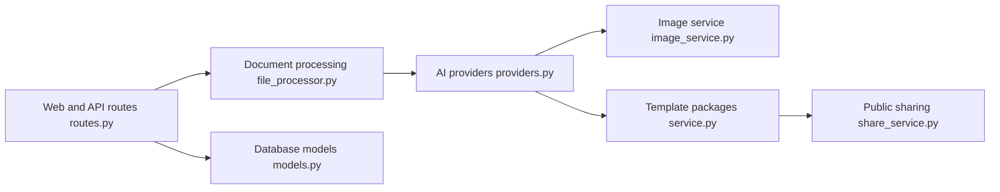

# sligter/LandPPT

> Plateforme web qui génère des présentations éditables depuis un sujet ou un document, avec discours et vidéo.

## Le problème
Produire un diaporama complet (plan, mise en page, images, notes de présentation, exports) est long.

## Ce que ça fait vraiment
Flux en quatre étapes : besoins, plan, suivi des tâches, génération de slides HTML en parallèle. Sources d'IA : OpenAI, Claude, Gemini, Azure, Ollama et API compatibles. Recherche approfondie (Tavily, SearXNG), images (galerie locale, Pixabay/Unsplash, génération IA), discours et narration Edge-TTS avec export vidéo MP4. Exports PDF, HTML, PPTX, DOCX, Markdown.

## Comment c'est branché


## Essayer
```bash
git clone https://github.com/sligter/LandPPT.git
cd LandPPT
uv sync --extra dev
cp .env.example .env
uv run python run.py
```

## Coût et pièges
Au moins une clé de fournisseur IA. PPTX éditable standard : clé commerciale Apryse (`APRYSE_LICENSE_KEY`) ; sinon PPTX en images non éditable. Compte admin par défaut `admin`/`admin123` à changer en production. ffmpeg pour la vidéo.

## Ce que ce n'est pas
Pas une alternative gratuite à PowerPoint pour tout export éditable. Le README déclare Apache 2.0 mais GitHub n'identifie pas la licence : à vérifier.

## Alternatives
Aucune alternative nommée dans le README.

## Pour toi
À surveiller : démo rapide en SQLite, mais l'export éditable dépend d'une licence tierce et le mainteneur est unique.

