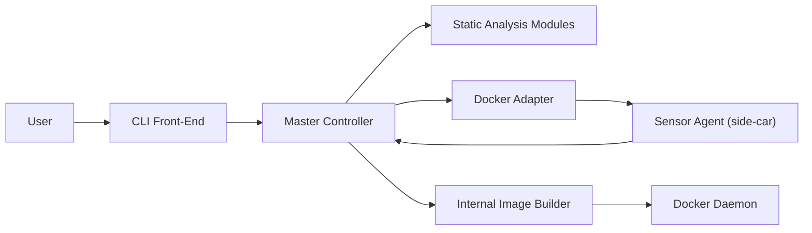

# slimtoolkit/slim

> CLI qui analyse une image de conteneur et produit une version réduite, avec profils Seccomp/AppArmor.

## Le problème
Les images Docker embarquent OS, paquets et outils inutiles : plusieurs centaines de Mo et une surface d'attaque large. Les optimiser à la main demande de connaître chaque dépendance.

## Ce que ça fait vraiment
`slim build` lance un conteneur temporaire avec un sensor qui observe fichiers et appels système (fanotify, ptrace) pendant des sondes HTTP ou tes tests.
Il ne garde que ce qui a été utilisé et reconstruit une image `.slim` ; exemples cités de 30× plus petite.
`xray` fait l'analyse statique et reconstitue le Dockerfile ; `lint`, `debug`, `merge`, `registry`, `vulnerability` complètent.
Génère des profils Seccomp et AppArmor ; fonctionne aussi avec Kubernetes pour `debug`.

## Comment c'est branché


## Essayer
```bash
curl -sL https://raw.githubusercontent.com/slimtoolkit/slim/master/scripts/install-slim.sh | sudo -E bash -
brew install docker-slim
docker pull dslim/slim
slim build my/sample-app
slim xray --target my/sample-app
```

## Coût et pièges
Gratuit, nécessite un démon Docker. Les applis qui chargent du code dynamiquement exigent des sondes ou `--include-path`, sinon l'image minifiée casse.

## Ce que ce n'est pas
Pas magique : sans exercer tous les chemins de l'appli, des fichiers nécessaires disparaissent. Le README pousse aussi l'offre commerciale Root.io, distincte de l'outil.

## Alternatives
Aucune alternative nommée dans le README.

## Pour toi
À adopter pour tes images de serving ML : réduire des images Python de plusieurs centaines de Mo sans réécrire le Dockerfile se rentabilise vite, à condition de tester l'image finale.
