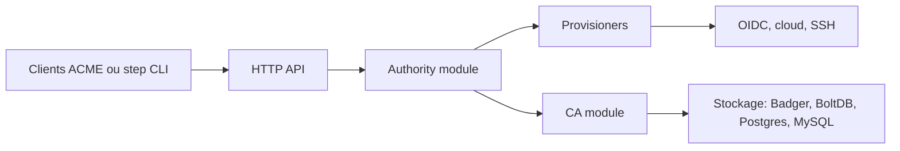

# smallstep/certificates

> step-ca : autorité de certification en ligne pour émettre et renouveler automatiquement des certificats TLS et SSH.

## Le problème
Monter une PKI privée est hors de portée de beaucoup de petites équipes, et les certificats à durée longue se gèrent mal.

## Ce que ça fait vraiment
Émet des certificats HTTPS et clients, ainsi que des certificats SSH pour personnes et hôtes. Chaque demande est autorisée par un provisioner : ACME, jeton OIDC, document d'identité cloud (AWS, GCP, Azure), jeton JWK, certificat X.509, SCEP, etc. Les certificats sont de courte durée avec renouvellement automatique. Le stockage passe par Badger, BoltDB, Postgres ou MySQL. Le client de référence est le CLI `step`.

## Comment c'est branché


## Essayer
Le README renvoie à la documentation d'installation et ne donne pas de commande d'installation. Seule est fournie l'aide du CLI :
```bash
step help --http=:8080
```

## Coût et pièges
Gratuit. Le README oriente vers l'offre commerciale pour : plusieurs CA, révocation active (CRL, OCSP), haute disponibilité, interface web, HSM, FIPS, EAB.

## Ce que ce n'est pas
Pas une PKI multi-CA ni un produit clé en main haute disponibilité : `step-ca` vise une PKI à deux niveaux pour DevOps. La révocation est « passive » (certificats courts).

## Alternatives
Aucune alternative nommée dans le README (l'offre commerciale de Smallstep est citée pour les besoins avancés).

## Pour toi
Surveiller : utile le jour où tes services ML internes ont besoin de TLS mutuel ou d'un ACME privé, sans être un outil data à installer par défaut.

