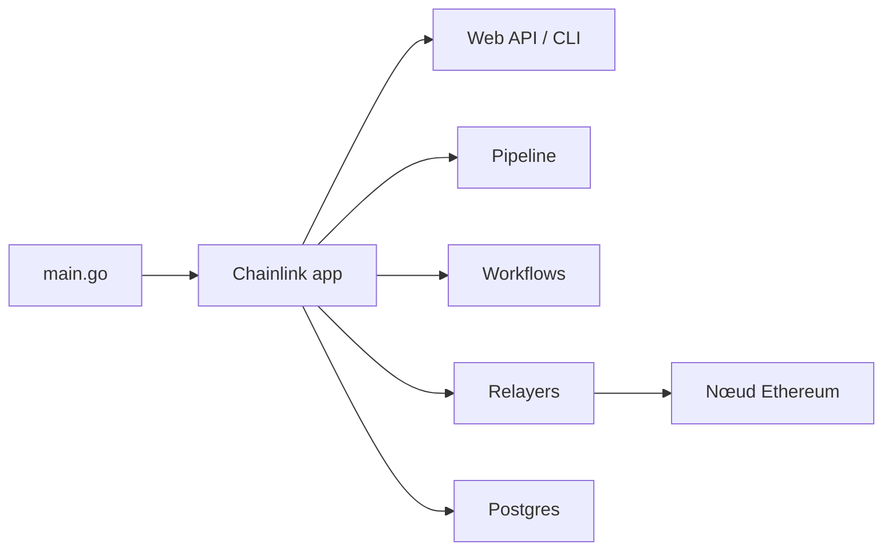

# smartcontractkit/chainlink

> Nœud oracle Chainlink en Go, qui relie des smart contracts à des données hors chaîne.

## Le problème
Les smart contracts n'ont pas accès aux données du monde réel ni au calcul hors chaîne sans un tiers de confiance.

## Ce que ça fait vraiment
Un binaire de nœud long-running adossé à Postgres, configuré en TOML et variables d'environnement.
Un moteur de pipeline de tâches (HTTP, parsing, appels et transactions ETH), plus un sous-système workflows/capabilities.
Des services protocolaires : OCR, VRF, CCIP, Functions, relayers multi-chaînes.
UI web, API GraphQL et CLI d'administration sur le port 6688.

## Comment c'est branché


## Essayer
```bash
git clone https://github.com/smartcontractkit/chainlink && cd chainlink
make install
chainlink node start
```

## Coût et pièges
Il faut Go, Node 20, pnpm, Postgres et un nœud Ethereum avec websocket. Certains plugins demandent un GITHUB_TOKEN pour des dépôts privés.

## Ce que ce n'est pas
Pas une bibliothèque de développement de contrats ni un outil data. Nethermind et Erigon sont « supportés mais cassés ».

## Alternatives
Aucune alternative nommée dans le README.

## Pour toi
À ignorer : c'est de l'infrastructure blockchain pour opérateurs de nœuds, sans lien avec un travail data, IA ou MLOps.
