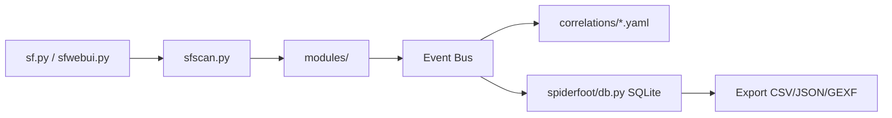

# smicallef/spiderfoot

> Automatise la collecte de renseignements ouverts (OSINT) sur un domaine, une IP ou une identité.

## Le problème
Recenser à la main ce qu'une organisation ou une personne expose sur Internet oblige à interroger des dizaines de sources, une par une, puis à recouper les résultats.

## Ce que ça fait vraiment
Plus de 200 modules interrogent des API publiques, des listes de réputation ou des outils locaux (DNSTwist, Nmap, Nuclei…) et se passent leurs trouvailles selon un modèle publication/abonnement. Un moteur de corrélation, piloté par 37 règles YAML, croise les résultats. Tout est stocké dans SQLite, consultable via l'interface web embarquée ou en ligne de commande, exportable en CSV, JSON ou GEXF. Les cibles vont de l'IP au nom de personne en passant par l'adresse e-mail.

## Comment c'est branché


## Essayer
```bash
wget https://github.com/smicallef/spiderfoot/archive/v4.0.tar.gz
tar zxvf v4.0.tar.gz
cd spiderfoot-4.0
pip3 install -r requirements.txt
python3 ./sf.py -l 127.0.0.1:5001
```

## Coût et pièges
Gratuit et sous licence MIT. La plupart des modules n'exigent pas de clé ; certains ont un palier gratuit, d'autres sont payants. Le README recommande la version packagée plutôt que master, moins testée. Python 3.7 minimum.

## Ce que ce n'est pas
Ce n'est pas un outil à pointer sur n'importe quelle cible : le README évoque un usage offensif (test d'intrusion) comme défensif ; il ne se justifie que sur un périmètre qu'on possède ou pour lequel on a un mandat. Certains modules interrogent des données personnelles (noms, téléphones, fuites) : le cadre légal (RGPD notamment) s'applique. Les fonctions de suivi continu et de multi-utilisateurs relèvent de la version commerciale SpiderFoot HX.

## Alternatives
- SpiderFoot HX : version hébergée et managée, avec surveillance de surface d'attaque.

## Pour toi
À surveiller : utile pour cartographier ce qu'une organisation expose, mais peu lié à un travail data/IA courant, et mainteneur unique.

