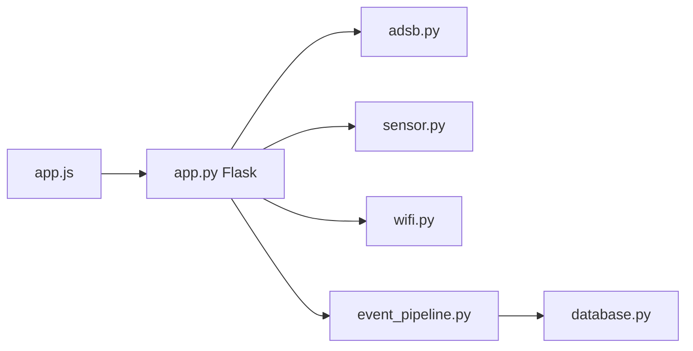

# smittix/intercept

> Interface web pour piloter des outils de radio logicielle : avions, bateaux, pagers, satellites, WiFi.

## Le problème
Les outils SDR (rtl_433, dump1090, multimon-ng…) s'utilisent séparément, en ligne de commande, chacun à sa façon.

## Ce que ça fait vraiment
Une application Flask regroupe des modes : décodage de pagers, capteurs 433 MHz, suivi ADS-B et AIS, ACARS, satellites météo, APRS, scan WiFi et Bluetooth, GPS, détection de drones, TSCM, Meshtastic. Événements poussés en SSE/WebSocket, agents distants, historique ADS-B optionnel en PostgreSQL. Matériel typique : une clé RTL-SDR.

## Comment c'est branché


## Essayer
```bash
git clone https://github.com/smittix/intercept.git
cd intercept
./setup.sh
sudo ./start.sh
```

## Coût et pièges
Matériel SDR (≈25-35 $), mode privilégié Docker, identifiants par défaut `admin / admin` à changer avant exposition. Écoute de communications soumise à autorisation légale.

## Ce que ce n'est pas
Pas un outil purement logiciel. Le README indique avoir été développé avec l'aide de l'IA.

## Alternatives
Aucune alternative nommée ; il enveloppe rtl-sdr, dump1090, SatDump, direwolf, entre autres.

## Pour toi
À ignorer : domaine radio/SDR sans lien avec data ou MLOps, et exige du matériel dédié.

