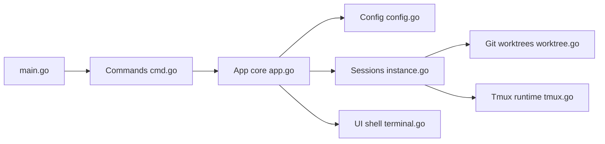

# smtg-ai/claude-squad

> TUI en Go qui fait tourner plusieurs agents de code en parallèle, chacun dans son worktree git.

## Le problème
Lancer plusieurs Claude Code, Codex ou Aider sur le même dépôt provoque des conflits de fichiers et une jonglerie entre terminaux.

## Ce que ça fait vraiment
`cs` crée pour chaque tâche une session tmux et un worktree git sur sa propre branche. L'interface liste les sessions, montre aperçu et diff, permet de s'attacher pour relancer un prompt, de committer et pousser, de mettre en pause ou reprendre. Profils configurables dans `~/.claude-squad/config.json` pour choisir le programme (claude par défaut, codex, gemini, aider). Mode `--autoyes` expérimental.

## Comment c'est branché


## Essayer
```bash
brew install claude-squad
ln -s "$(brew --prefix)/bin/claude-squad" "$(brew --prefix)/bin/cs"
curl -fsSL https://raw.githubusercontent.com/smtg-ai/claude-squad/main/install.sh | bash
cs
cs -p "codex"
```

## Coût et pièges
Outil gratuit ; tmux et gh requis. Le coût vient des agents lancés (abonnements ou clés API), multiplié par le nombre de sessions.

## Ce que ce n'est pas
Pas un agent en soi : un coordinateur autour de tmux et git. Licence AGPL-3.0, sans effet pour un usage local mais contraignante si tu le redistribues modifié.

## Alternatives
Aucune alternative nommée ; Aider, Codex et Gemini sont des agents pilotables, pas des alternatives.

## Pour toi
À adopter si tu utilises déjà des agents de code : l'isolation par worktree règle proprement les conflits et permet de lancer plusieurs tâches en fond, avec une revue du diff avant de pousser.
