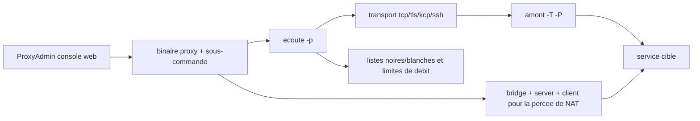

# snail007/goproxy

> **A single Go binary that sets up proxies, encrypted tunnels and NAT traversal from the command line.**

## The problem

Exposing a service that sits behind NAT or a firewall, chaining several proxy hops, or forwarding a TCP/UDP port usually means stacking separate tools: SSH, an HTTP proxy, a SOCKS5 relay, a tunnelling daemon. The README frames it through concrete cases: reaching an internal machine from home, debugging a web callback locally, playing LAN games remotely.

## What it actually does

One `proxy` executable with a sub-command per role: `http`, `tcp`, `udp`, `socks`, `sps`, `dns`, plus `bridge`/`server`/`client` (and the multi-connection variants `tbridge`/`tserver`/`tclient`) for NAT traversal. Each sub-command listens with `-p` and forwards to an upstream with `-T`/`-P`, so second, third or N-level chains are just more invocations. Transport between instances can be TLS (`-t tls` with `-C`/`-K`), KCP (`--kcp-key`) or an SSH relay (`-T ssh`), with extra AES encryption (`-z`/`-Z`) and compression (`-m`/`-M`). It also carries domain and client-IP allow/deny lists, rate and connection limits, upstream load balancing by repeating `-P`, an anti-pollution DNS proxy, protocol conversion (SPS) and a transparent proxy mode paired with iptables. `proxy keygen` produces the self-signed certificates.

## How it is wired



The same binary plays every role: listen mode and upstream mode combine, so a three-hop chain is the same program run on three machines. For NAT traversal, `client` (inside the private network) and `server` (on the public VPS) both dial a `bridge` that joins them, with an optional direct path via `--p2p`. Settings can come from a file passed as `proxy @configfile.txt`. The ProxyAdmin web console lives in a separate repository.

## Trying it

```bash
# automatic install, 64-bit Linux VPS, as root (free edition)
bash -c "$(curl -s -L https://raw.githubusercontent.com/snail007/goproxy/master/install_auto.sh)"

# self-signed certificate
proxy keygen -C proxy

# plain HTTP proxy in the background
proxy http -t tcp -p "0.0.0.0:38080" --daemon

# NAT traversal: on the public VPS
proxy bridge -p ":33080" -C proxy.crt -K proxy.key
proxy server -r ":28080@:80" -P "127.0.0.1:33080" -C proxy.crt -K proxy.key
# on the internal machine
proxy client -P "22.22.22.22:33080" -C proxy.crt -K proxy.key
```

## Cost and traps

No dependency stack: it is a binary from the releases page, configuration lives in `/etc/proxy`, and every operation needs root. The main trap is the freemium split: the manual documents the **commercial** edition, and the free edition leaves out advanced parameters such as authentication — an `err: unknown long flag '-a'` means the option is paid. The second trap is stated by the author: source code is released on a delay, as a response to reuse that ignores GPLv3, so what you install is largely a binary you cannot rebuild from the published tree. Part of the documentation and several links are Chinese-only.

## What it is not

It is not an interception or inspection proxy for debugging HTTP traffic: it carries and chains, it gives no request-by-request analysis UI. It is not a web server or an application reverse proxy with automatic certificate management. It is not a project whose code you read before deploying, given the delayed source release. And the free edition is not the documented edition: a share of the manual's features sits behind a purchase.

## Alternatives

- **go-gost/gost**: same family of multi-protocol tunnels and chaining, preferable if continuously published source matters.
- **ehang-io/nps**: NAT traversal with a built-in web console, simpler when the need is only exposing an internal service.
- **mitmproxy/mitmproxy**: the opposite choice, for inspecting and rewriting traffic rather than transporting it.
- **caddyserver/caddy**: for public HTTP reverse proxying with automatic TLS, not for arbitrary TCP/UDP tunnels.

## For you

Mostly useful as an occasional infrastructure tool: exposing a demo API, a notebook or an inference service running on an internal box without standing up a VPN. Watch rather than adopt in production: single maintainer, delayed sources, and key features reserved for the paid edition.
