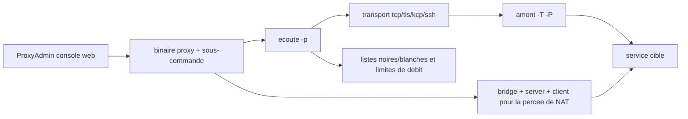

# snail007/goproxy

> **Un binaire Go unique qui monte proxys, tunnels chiffrés et percée de NAT en ligne de commande.**

## Le problème

Exposer un service derrière un NAT ou un pare-feu, chaîner plusieurs sauts de proxy ou rediriger un port TCP/UDP demande d'ordinaire d'empiler plusieurs outils distincts (SSH, un proxy HTTP, un relais SOCKS5, un outil de tunnel). Le README part de cas très concrets : accéder à une machine du réseau interne depuis chez soi, déboguer une interface web en local, jouer en LAN à distance.

## Ce que ça fait vraiment

Un exécutable `proxy` avec des sous-commandes par rôle : `http`, `tcp`, `udp`, `socks`, `sps`, `dns`, plus `bridge`/`server`/`client` (et leurs variantes multi-liens `tbridge`/`tserver`/`tclient`) pour la percée de NAT. Chaque sous-commande écoute (`-p`) et pousse vers un amont (`-T`/`-P`), ce qui permet d'enchaîner des proxys de niveau 2, 3 ou N. Le transport entre deux instances peut être TLS (`-t tls` avec `-C`/`-K`), KCP (`--kcp-key`), un relais SSH (`-T ssh`), avec chiffrement AES supplémentaire (`-z`/`-Z`) et compression (`-m`/`-M`). S'y ajoutent listes noires/blanches de domaines et d'IP client, limitation de débit et de connexions, équilibrage de charge par répétition de `-P`, proxy DNS anti-pollution, conversion de protocole (SPS) et proxy transparent en liaison avec iptables. `proxy keygen` génère les certificats auto-signés nécessaires.

## Comment c'est branché



Un même binaire joue tous les rôles : le mode d'écoute et le mode amont se combinent, si bien qu'une chaîne de trois proxys est trois invocations du même programme sur trois machines. Pour la percée de NAT, `client` (réseau interne) et `server` (VPS) se connectent tous deux à un `bridge` qui fait le raccord, avec bascule possible en direct via `--p2p`. La configuration peut venir d'un fichier passé par `proxy @configfile.txt`. La console web ProxyAdmin est un dépôt séparé.

## Essayer

```bash
# installation automatique, VPS Linux 64 bits, en root (version libre)
bash -c "$(curl -s -L https://raw.githubusercontent.com/snail007/goproxy/master/install_auto.sh)"

# certificat auto-signé
proxy keygen -C proxy

# proxy HTTP simple en tâche de fond
proxy http -t tcp -p "0.0.0.0:38080" --daemon

# percée de NAT : sur le VPS public
proxy bridge -p ":33080" -C proxy.crt -K proxy.key
proxy server -r ":28080@:80" -P "127.0.0.1:33080" -C proxy.crt -K proxy.key
# sur la machine du réseau interne
proxy client -P "22.22.22.22:33080" -C proxy.crt -K proxy.key
```

## Coût et pièges

Rien à installer côté dépendances : c'est un binaire téléchargé depuis les *releases*, et le répertoire de configuration est `/etc/proxy`. Toutes les opérations réclament les droits root. Le piège principal est le modèle freemium : le manuel décrit les fonctions **de la version commerciale**, et la version libre n'inclut pas les paramètres avancés comme l'authentification — un `err: unknown long flag '-a'` signale une option payante. Second piège, annoncé par l'auteur lui-même : le code source est publié en différé, par représailles contre les réutilisations qui ignorent la GPLv3 ; on installe donc surtout un binaire qu'on ne peut pas recompiler à partir de l'état publié. Une partie de la documentation et des liens ne sont qu'en chinois.

## Ce que ce n'est pas

Ce n'est pas un proxy d'interception ou d'inspection de trafic HTTP pour le débogage : il transporte et chaîne, il ne donne pas d'interface d'analyse requête par requête. Ce n'est pas non plus un serveur web ni un reverse proxy applicatif avec gestion de certificats automatique. Ce n'est pas un projet dont on lit le code avant de le déployer, vu la publication différée des sources. Enfin, la version gratuite n'est pas la version documentée : une part des fonctionnalités du manuel est derrière l'achat.

## Alternatives

- **go-gost/gost** : même famille de tunnels et de chaînage multi-protocoles, à préférer si l'on tient à un code source publié en continu.
- **ehang-io/nps** : orienté percée de NAT avec console web intégrée, plus simple si le besoin se limite à exposer un service interne.
- **mitmproxy/mitmproxy** : choix inverse, pour inspecter et modifier le trafic plutôt que pour le transporter.
- **caddyserver/caddy** : pour du reverse proxy HTTP public avec TLS automatique, pas pour du tunnel TCP/UDP arbitraire.

## Pour toi

Utile surtout comme outil d'infrastructure ponctuel : exposer une API de démo, un notebook ou un service d'inférence tournant sur une machine interne, sans monter de VPN. À surveiller plutôt qu'à adopter en production : mainteneur unique, sources publiées en différé et fonctions clés réservées à la version payante.
