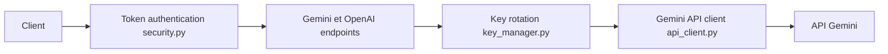

# snailyp/gemini-balance

> Proxy FastAPI qui répartit la charge entre plusieurs clés d'API Gemini et imite aussi l'API OpenAI.

## Le problème
Les quotas d'une seule clé Gemini sont vite saturés et les clients OpenAI ne parlent pas à Gemini.

## Ce que ça fait vraiment
Fait tourner plusieurs clés (`API_KEYS`) avec retries et désactivation après trop d'échecs, expose les formats Gemini et OpenAI (chat, embeddings, images), propose recherche web, édition d'image, journaux et une page d'état des clés. Configuration modifiable à chaud depuis l'admin.

## Comment c'est branché


## Essayer
```bash
docker pull ghcr.io/snailyp/gemini-balance:latest
docker run -d -p 8000:8000 --name gemini-balance -v ./data:/app/data --env-file .env ghcr.io/snailyp/gemini-balance:latest
```

## Coût et pièges
Clés Gemini à ta charge ; base MySQL ou SQLite. Le README déclare CC BY-NC 4.0 : aucun usage commercial. Mutualiser des clés peut enfreindre les conditions de Google (à vérifier). Dernier push en septembre 2025.

## Ce que ce n'est pas
Pas un revendeur d'accès : l'auteur affirme ne rien vendre. Ne sert pas à contourner un quota gratuit sans en assumer les conditions.

## Alternatives
Aucune alternative nommée dans le README.

## Pour toi
À ignorer : licence non commerciale, mainteneur unique et usage douteux des clés ; préférer un vrai passerelle LLM sous licence permissive.

