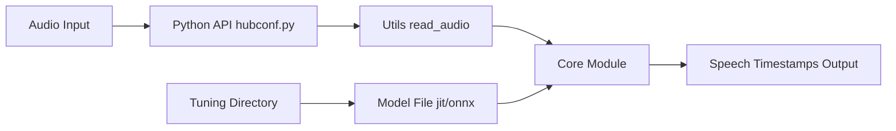

# snakers4/silero-vad

> Détecteur d'activité vocale pré-entraîné, léger, en PyTorch/ONNX, tournant sur CPU.

## Le problème
Découper l'audio en segments de parole (avant transcription, bots vocaux, nettoyage de données) demande un VAD fiable et rapide.

## Ce que ça fait vraiment
`get_speech_timestamps` renvoie les segments de parole d'un fichier audio (en échantillons ou secondes).
Modèle JIT ~2 Mo, moins de 1 ms par chunk de 30 ms sur un thread CPU, 8 et 16 kHz.
Entraîné sur des corpus couvrant plus de 6000 langues ; versions PyTorch et ONNX.
Exemples communautaires C++, Rust, Go, Java, C#, navigateur (ONNX Runtime Web) ; scripts de tuning de seuils.

## Comment c'est branché


## Essayer
```bash
pip install silero-vad
```

## Coût et pièges
Gratuit, MIT, sans télémétrie ni clé. Requiert un backend audio pour torchaudio (FFmpeg, sox ou soundfile). En ONNX seul, l'E/S est à réimplémenter.

## Ce que ce n'est pas
Pas un modèle de transcription (STT) ni de diarisation : il dit seulement où il y a de la parole.

## Alternatives
Aucune nommée dans le README (renvoi aux modèles STT Silero).

## Pour toi
À adopter : brique standard devant Whisper ou tout pipeline audio, gratuite et rapide sur CPU, qui réduit le coût de transcription.
