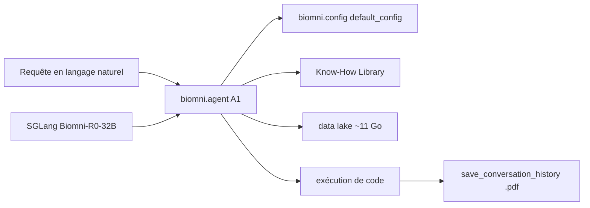

# snap-stanford/Biomni

> Agent biomédical généraliste qui exécute des tâches de recherche par raisonnement et code.

## Le problème
Une tâche de recherche biomédicale enchaîne recherche documentaire, planification et code d'analyse.
Chaque étape se fait à la main, dans des outils sans continuité.

## Ce que ça fait vraiment
Un agent `A1` piloté en langage naturel : `agent.go("Plan a CRISPR screen…")`, planification et exécution de code.
Une Know-How Library de protocoles et bonnes pratiques, récupérée automatiquement selon la requête.
Biomni-R0, modèle de raisonnement sur Qwen-32B entraîné par apprentissage par renforcement, servi via SGLang.
Biomni-Eval1 : 433 instances sur 10 tâches de raisonnement biologique, avec un évaluateur Python.

## Comment c'est branché


## Essayer
```bash
conda activate biomni_e1
pip install biomni --upgrade
```

## Coût et pièges
Le data lake se télécharge seul au premier lancement : environ 11 Go, désactivable via `expected_data_lake_files=[]`.
Clé d'API Anthropic ou autre à ta charge ; l'environnement conda est décrit comme massif, avec des conflits connus.

## Ce que ce n'est pas
Pas sûr par défaut : l'agent exécute du code généré avec tous les privilèges système, à isoler avant tout usage sérieux.
Pas synchronisé avec la plateforme web : la version publiée est gelée au 15 avril 2025.
Apache 2.0 côté Biomni, mais certains outils et bases intégrés portent des licences commerciales restrictives.

## Alternatives
Aucune alternative nommée dans le README.

## Pour toi
Bon cas d'étude d'agent scientifique outillé ; à ne lancer que dans un conteneur jetable.
