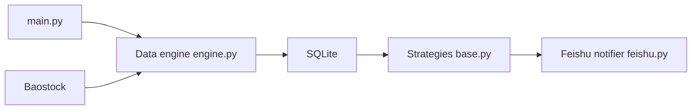

# sngyai/Sequoia-X

> Système de sélection d'actions A chinoises : données baostock, stratégies quantitatives, notifications Feishu.

## Le problème
Repérer chaque soir, sur ~5200 actions, celles qui répondent à des critères techniques.

## Ce que ça fait vraiment
Récupère les cours journaliers (baostock, en SQLite), exécute six stratégies listées dans le README (TurtleTrade, MaVolume, HighTightFlag, LimitUpShakeout, UptrendLimitDown, RpsBreakout) et envoie les sélections non vides sur un webhook Feishu. Mode backfill initial d'environ 12 minutes, mode quotidien de 2 à 3 minutes.

## Comment c'est branché


## Essayer
```bash
uv sync
cp .env.example .env
python main.py --backfill
python main.py
```

## Coût et pièges
Gratuit ; il faut un webhook Feishu. Licence absente : droits de réutilisation incertains. Le diagramme mentionne Akshare et une stratégie PrivatePlacement absente du README.

## Ce que ce n'est pas
Pas un conseil financier ni un moteur de backtest documenté.

## Alternatives
Aucune alternative nommée dans le README.

## Pour toi
À ignorer : marché A uniquement, aucune licence, sans validation des stratégies annoncée.

