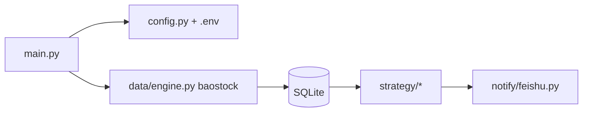

# sngyai/Sequoia

> Système de sélection d'actions pour le marché chinois A, avec stratégies et notification Feishu.

## Le problème
Filtrer chaque jour les quelque 5 200 actions A selon des stratégies techniques sans le faire à la main.

## Ce que ça fait vraiment
Sequoia-X V2 récupère les cours journaliers ajustés depuis baostock, les stocke en SQLite local, exécute six stratégies (TurtleTrade, MaVolume, HighTightFlag, LimitUpShakeout, UptrendLimitDown, RpsBreakout) et pousse le résultat sur un groupe Feishu. Deux modes : quotidien (8 processus, 2 à 3 minutes) et remplissage historique (environ 12 minutes). Le diagramme fourni décrit l'ancienne version (AKShare, WxPusher) et ne correspond plus au README.

## Comment c'est branché


## Essayer
```bash
uv sync
cp .env.example .env
python main.py --backfill
python main.py
```

## Coût et pièges
Gratuit ; webhook Feishu à renseigner dans `.env`. Aucune licence déclarée : usage et redistribution non autorisés explicitement.

## Ce que ce n'est pas
Pas un conseil d'investissement ni un backtest documenté : aucun résultat de performance n'est présenté. Marché limité à la Chine.

## Alternatives
Aucune alternative nommée dans le README.

## Pour toi
À ignorer : outil de niche sur un seul marché, sans licence et sans évaluation de ses stratégies.
