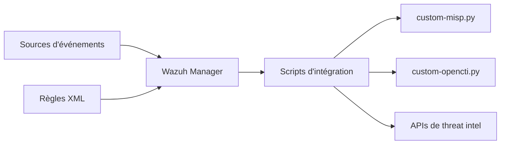

# socfortress/Wazuh-Rules

> Règles de détection et scripts d'intégration pour étoffer un Wazuh Manager déjà déployé.

## Le problème
Les règles Wazuh par défaut sont jugées trop laxistes par les auteurs pour détecter les menaces récentes.

## Ce que ça fait vraiment
Dépôt de fichiers XML de règles (Sysmon Windows/Linux, Chainsaw, Suricata, Packetbeat…) et de scripts d'enrichissement (MISP, OpenCTI, AbuseIPDB, Office 365, Trend Micro, nmap). Un script bash les copie sur le manager.

## Comment c'est branché


## Essayer
```bash
curl -so ~/wazuh_socfortress_rules.sh https://raw.githubusercontent.com/socfortress/Wazuh-Rules/main/wazuh_socfortress_rules.sh && bash ~/wazuh_socfortress_rules.sh
```
À lancer en root, après sauvegarde de tes règles.

## Coût et pièges
Wazuh 4.x requis. Des identifiants de règle en doublon avec tes règles personnalisées peuvent faire échouer le service du manager. Aucune licence déclarée : droit de réutilisation flou.

## Ce que ce n'est pas
Pas un SIEM : ce sont des règles pour Wazuh. Le dépôt sert aussi de vitrine commerciale à SOCFortress.

## Alternatives
Aucune alternative citée dans le README.

## Pour toi
À ignorer sauf si tu administres Wazuh : hors périmètre data/IA, et l'absence de licence gêne tout usage en entreprise.

