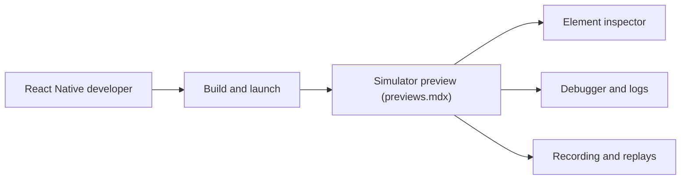

# software-mansion/radon-ide

> Extension VSCode et Cursor qui fait d'un éditeur un IDE pour applications React Native et Expo.

## Le problème
Développer en React Native oblige à jongler entre simulateur, inspecteur, débogueur et console.

## Ce que ça fait vraiment
- Construit et lance le projet, avec aperçu de simulateur dans l'éditeur.
- Inspecteur d'éléments, débogueur lié au code, console de logs, réglages d'appareil, enregistrement d'écran.
- Aperçu de composants ; la liste des composants du graphe mentionne aussi inspecteur réseau, Storybook, Maestro et Radon AI.
- Ce dépôt ne sert qu'au suivi des issues et aux discussions : le code n'y est pas.

## Comment c'est branché

## Essayer
Aucune commande documentée : installer depuis la place de marché de VSCode, Cursor ou Windsurf.

## Coût et pièges
Le README ne parle pas de prix. Licence présente mais non identifiée ; 142 issues ouvertes. Le code source n'est pas consultable ici.

## Ce que ce n'est pas
Pas un framework ni du code libre auditable depuis ce dépôt.

## Alternatives
Aucune alternative nommée dans le README.

## Pour toi
À ignorer : outil de développement mobile, sans lien avec data/IA/MLOps.

