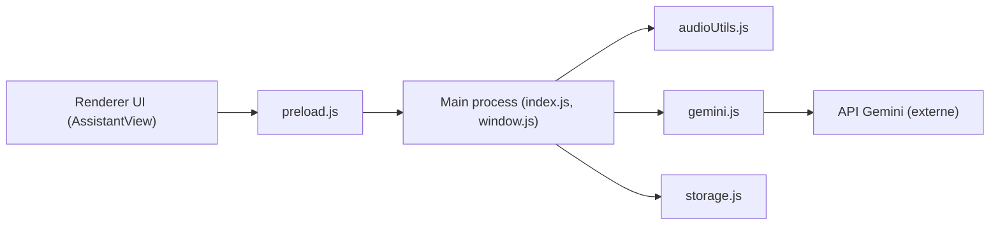

# sohzm/cheating-daddy

> Assistant IA en surcouche transparente qui répond en direct pendant entretiens, appels et réunions.

## Le problème
Répondre à chaud à des questions pendant un appel vidéo, sans quitter l'écran.

## Ce que ça fait vraiment
Application Electron : capture l'écran et l'audio (SystemAudioDump sur macOS, boucle audio sur Windows, micro sur Linux) et les envoie à Gemini 2.0 Flash Live, qui renvoie des réponses affichées dans une fenêtre toujours au-dessus, déplaçable et traversable par la souris. Profils : entretien, appel commercial, réunion, présentation, négociation. Pas de serveur dans le dépôt.

## Comment c'est branché


## Essayer
```bash
npm install
npm start
```

## Coût et pièges
Clé Gemini requise (Google AI Studio). Autorisations d'enregistrement d'écran et de micro. Linux : « à ne pas utiliser, juste pour tester », selon le README. En test, l'assistant ne répond pas à ta propre question : il faut simuler l'interlocuteur.

## Ce que ce n'est pas
Pas un outil de transcription ni d'archivage de réunion. Son usage principal décrit (aider pendant un entretien sans que l'interlocuteur le sache) soulève un problème d'honnêteté et de règles d'entretien.

## Alternatives
Aucune alternative nommée dans le README (Recall.ai, sponsor, est une API d'enregistrement).

## Pour toi
À ignorer : usage éthiquement douteux, dépendance à une API tierce et projet expérimental d'une seule personne.

