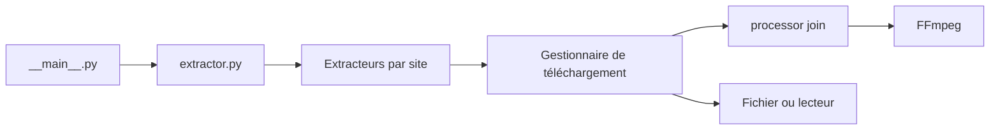

# soimort/you-get

> Petit utilitaire en ligne de commande pour télécharger vidéos, audios et images depuis le web.

## Le problème
Récupérer un média en ligne quand aucune option de téléchargement n'est proposée par le site.

## Ce que ça fait vraiment
Il extrait les flux d'un site (YouTube, Youku, Niconico…), choisit le format (`--itag`), télécharge, fusionne les morceaux via FFmpeg, peut lire dans un lecteur (`-p`), reprend un téléchargement, utilise proxy et cookies, et sort la liste d'URL ou du JSON. Le code montre des extracteurs par site, un gestionnaire de téléchargement et des processeurs FLV, MP4 et TS.

## Comment c'est branché


## Essayer
```bash
pip install you-get
you-get 'https://www.youtube.com/watch?v=jNQXAC9IVRw'
you-get -i 'https://www.youtube.com/watch?v=jNQXAC9IVRw'
you-get -o ~/Videos -O zoo.webm 'https://www.youtube.com/watch?v=jNQXAC9IVRw'
```

## Coût et pièges
Gratuit. FFmpeg requis pour fusionner et pour les hautes résolutions YouTube. Le README dit que des sites cassent « tout le temps ». Licence présente mais non identifiée par GitHub, alors que le README mentionne MIT.

## Ce que ce n'est pas
Ce n'est pas un droit de télécharger : le README renvoie la responsabilité à l'utilisateur. Le mode de scraping générique est qualifié d'expérimental.

## Alternatives
Aucune alternative nommée dans le README.

## Pour toi
Surveiller : peut servir à constituer un corpus audio ou vidéo, mais vérifie les conditions d'usage des sites avant tout usage sérieux.

