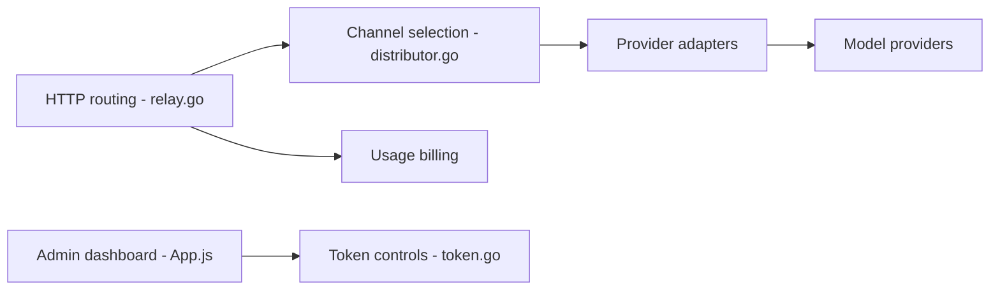

# songquanpeng/one-api

> Passerelle à format OpenAI unique devant de nombreux fournisseurs de LLM, avec jetons, quotas et facturation.

## Le problème
Chaque fournisseur de modèle a son API, ses clés et sa facturation ; il faut un point d'entrée unique et contrôlable.

## Ce que ça fait vraiment
Reçoit des requêtes au format OpenAI, choisit un canal (équilibrage, réessais), adapte la requête au fournisseur (OpenAI, Azure, Claude, Gemini, DeepSeek, Ollama, modèles chinois…), renvoie une réponse compatible en stream et comptabilise la consommation. Gère jetons, quotas, groupes, codes de recharge, connexions (email, GitHub, Feishu, WeChat), multi-serveurs avec MySQL/Redis.

## Comment c'est branché


## Essayer
```bash
docker run --name one-api -d --restart always -p 3000:3000 -e TZ=Asia/Shanghai -v /home/ubuntu/data/one-api:/data justsong/one-api
docker-compose up -d
```
Connexion initiale `root` / `123456` : à changer.

## Coût et pièges
Les appels aux modèles restent à ta charge. SQLite par défaut : sans volume monté, les données disparaissent ; en multi-serveurs, MySQL est obligatoire. Dernier push le 2026-01-09 (moins d'un an, pas d'alerte d'ancienneté).

## Ce que ce n'est pas
Pas un fournisseur de modèles. Licence MIT mais le README exige de conserver l'attribution en pied de page, sauf autorisation. Usage soumis aux règles chinoises sur l'IA générative.

## Alternatives
Aucune alternative nommée dans le README.

## Pour toi
À surveiller : pratique pour mutualiser des clés LLM en équipe, mais projet porté par une seule personne, avec mot de passe par défaut et clause d'attribution.

