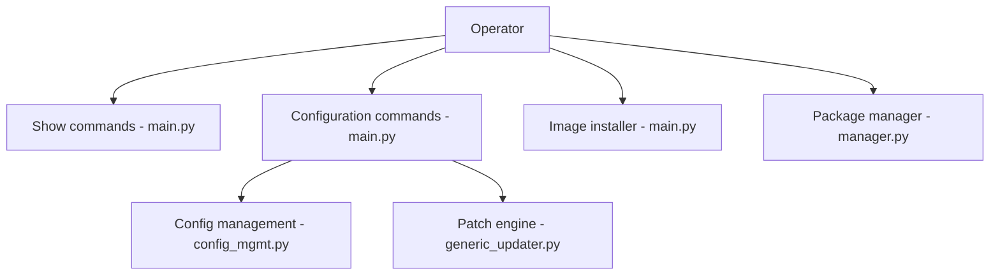

# sonic-net/sonic-utilities

> Outils en ligne de commande pour configurer et inspecter les commutateurs réseau SONiC, pour opérateurs réseau.

## Le problème
Un switch SONiC se pilote par sa base de configuration ; sans CLI dédiée, il faut manipuler les bases à la main.

## Ce que ça fait vraiment
Dépôt de deux paquets : une roue Python (`sonic-utilities`) avec les commandes `show`, `config`, `clear`, des outils de patch de configuration, d'installation d'images, de gestion de paquets et d'utilitaires matériels (transceivers, plateforme) ; et un paquet Debian de données (complétions bash, templates Jinja2). Il gère aussi le multi-ASIC.

## Comment c'est branché


## Essayer
```bash
make configure PLATFORM=generic
make -f Makefile.work BLDENV=bookworm KEEP_SLAVE_ON=yes target/python-wheels/bookworm/sonic_utilities-1.2-py3-none-any.whl
python3 setup.py bdist_wheel
python3 setup.py test
```

## Coût et pièges
Les dépendances SONiC (libyang, swsscommon…) ne sont pas sur PyPI : il faut le système de build `sonic-buildimage` dans un conteneur. Un ICLA est exigé pour contribuer. La licence est présente mais non identifiée par GitHub.

## Ce que ce n'est pas
Pas utilisable seul sur un poste ordinaire : il présuppose un switch SONiC. Pas un outil de réseau généraliste.

## Alternatives
Aucune alternative nommée dans le README.

## Pour toi
À ignorer : ça ne concerne que l'exploitation de switches SONiC, hors du périmètre data/IA/MLOps.

