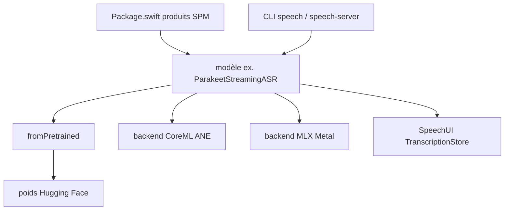

# soniqo/speech-swift

> Collection de modèles de parole exécutés localement sur Apple Silicon via MLX Swift et CoreML.

## Le problème
Transcrire, synthétiser ou diariser de la parole passe presque toujours par une API distante, donc par une facture et une sortie de données.
Assembler plusieurs modèles locaux impose autant de chaînes de conversion et de runtimes différents.

## Ce que ça fait vraiment
Couvre neuf familles : reconnaissance, alignement, synthèse, LLM et traduction, parole-à-parole, débruitage et restauration, séparation de sources, génération musicale, détection de tour de parole et diarisation.
Chaque modèle est un produit SPM distinct — on n'importe que ce qu'on utilise — d'`OmnilingualASR` (1 672 langues) à `KokoroTTS` (82 M, Neural Engine) ou `SpeechVAD`.
Une CLI `speech` expose transcription, synthèse, traduction et dialogue vocal, plus un `speech-server` HTTP/WebSocket compatible OpenAI (`/v1/realtime`, `/v1/audio/transcriptions`).
Des vues SwiftUI minimales (`TranscriptionView`, `TranscriptionStore`) branchent directement un flux de transcription partielle.

## Comment c'est branché


## Essayer
```bash
brew install speech
speech transcribe recording.wav
speech speak "Hello world"
speech translate "Hello, how are you?" --to es
speech-server --port 8080
make build
```

## Coût et pièges
Apple Silicon obligatoire, macOS 15+ ou iOS 18+, Swift 6 et Xcode 16 avec Metal Toolchain ; Homebrew ARM natif uniquement.
`make build` compile aussi la bibliothèque de shaders Metal : sans elle, `Failed to load the default metallib` à l'exécution.
`--debug-timeline` peut révéler les arguments d'outils : à garder hors des journaux partagés.

## Ce que ce n'est pas
Pas entièrement réutilisable commercialement : F5-TTS est sous licence non commerciale et Higgs TTS 3 sous licence recherche/non commerciale — les autres varient (MIT, Apache-2.0, CC-BY-4.0).
Pas une bibliothèque légère : le catalogue va de 82 M à 11 B de paramètres, avec des empreintes mémoire très différentes.
`SpeechUI` ne livre que deux composants ; visualisation et lecture audio restent à faire avec AVFoundation.

## Alternatives
Aucune alternative nommée dans le README.

## Pour toi
Le catalogue à connaître si un jour tu dois transcrire sans envoyer l'audio dehors — à condition d'avoir un Mac Apple Silicon et de trier les licences.
