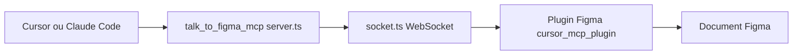

# sonnylazuardi/cursor-talk-to-figma-mcp

> Relie Cursor ou Claude Code à Figma par MCP pour lire et modifier des designs.

## Le problème
Un agent de code ne voit pas les maquettes Figma et ne peut pas les modifier en série.

## Ce que ça fait vraiment
Un serveur MCP TypeScript expose des outils Figma (lecture de sélection, création de cadres et textes, styles, mise en page auto, composants, export d'image, annotations, connecteurs FigJam). Un serveur WebSocket relie le serveur MCP à un plugin Figma installé en développement. Remplacement de texte en masse et propagation d'overrides d'instances.

## Comment c'est branché


## Essayer
```bash
curl -fsSL https://bun.sh/install | bash
bun setup
bun socket
```

## Coût et pièges
Gratuit ; demande Bun, un compte Figma, le plugin lié localement et un canal `join_channel` avant toute commande. Sous WSL, il faut décommenter `hostname: "0.0.0.0"` dans `src/socket.ts`.

## Ce que ce n'est pas
Pas un outil de données : il agit sur des maquettes, et l'export d'image est limité (base64 en texte). Les commandes peuvent lever des exceptions.

## Alternatives
Aucune alternative nommée dans le README.

## Pour toi
À ignorer : hors profil data/IA/MLOps, utile seulement si tu fais du front piloté par agent.
