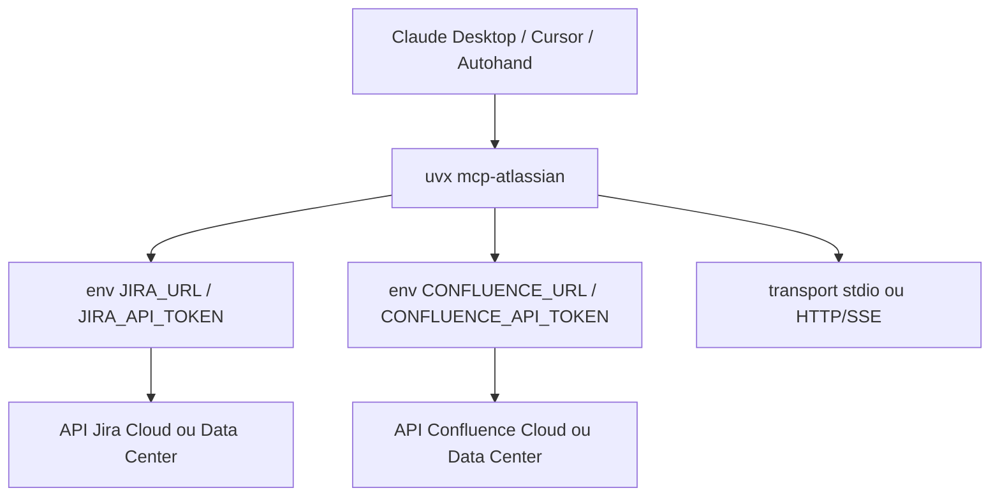

# sooperset/mcp-atlassian

> Serveur MCP donnant à un assistant l'accès en lecture-écriture à Jira et Confluence.

## Le problème
Les tickets et la documentation vivent dans Atlassian, l'assistant de code vit ailleurs : le contexte se recopie à la main.
Créer un bug, changer un statut ou chercher une page de onboarding sort systématiquement de l'outil.

## Ce que ça fait vraiment
Il expose 98 outils MCP couvrant Jira et Confluence, dont `jira_search` (JQL), `jira_create_issue`, `jira_transition_issue`, `confluence_search` (CQL), `confluence_create_page` et `confluence_add_comment`.
Il fonctionne sur Cloud comme sur Server/Data Center — Confluence v6.0+, Jira v8.14+ — avec jeton API pour le premier, Personal Access Token pour le second.
L'authentification couvre aussi OAuth 2.0, et le transport HTTP propose SSE, streamable-http et un mode multi-utilisateur.
La documentation est publiée en `llms.txt` et `llms-full.txt`, directement consommables par un modèle.

## Comment c'est branché


## Essayer
```bash
# configuration MCP : command "uvx", args ["mcp-atlassian"],
# env JIRA_URL / JIRA_USERNAME / JIRA_API_TOKEN / CONFLUENCE_*
autohand mcp add mcp-atlassian env \
  JIRA_URL=https://your-company.atlassian.net \
  JIRA_USERNAME=your.email@company.com \
  JIRA_API_TOKEN=your_api_token \
  uvx mcp-atlassian
```
Le jeton se crée sur `https://id.atlassian.com/manage-profile/security/api-tokens`.

## Coût et pièges
Le serveur est gratuit ; il faut un compte Atlassian et un jeton API en clair dans la configuration MCP ou un `.env`, que le README demande explicitement de protéger.
Sur Server/Data Center, c'est `JIRA_PERSONAL_TOKEN` et non le couple utilisateur + jeton — erreur classique au premier essai.

## Ce que ce n'est pas
Ce n'est pas un connecteur en lecture seule : l'assistant peut créer des tickets et modifier des pages avec tes droits.
Ce n'est pas une intégration officielle Atlassian, et le README ne déclare aucune licence.

## Alternatives
Aucune alternative n'est nommée dans le README.

## Pour toi
Le raccourci évident si ton équipe vit dans Jira : ton agent lit les tickets sans que tu fasses le copier-coller.
