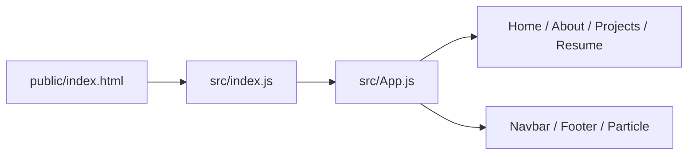

# soumyajit4419/Portfolio

> Site portfolio personnel en React, à forker et personnaliser, avec crédit demandé à l'auteur.

## Le problème
Créer rapidement un site vitrine avec présentation, projets et CV.

## Ce que ça fait vraiment
Application React multi-pages (Accueil, À propos, Projets, CV) avec React-Bootstrap et CSS personnalisable. On modifie les composants dans `/src/components/` pour mettre ses informations. Le README cite Node/Express, mais l'arborescence est entièrement côté client ; déploiement via Vercel.

## Comment c'est branché


## Essayer
```bash
npm install
npm start
```

## Coût et pièges
Gratuit. Aucune licence déclarée : le droit de réutiliser n'est pas clair malgré l'invite à forker. Le README est très court.

## Ce que ce n'est pas
Pas un framework de portfolio : un site personnel de l'auteur, à vider de ses données.

## Alternatives
Aucune nommée dans le README.

## Pour toi
À ignorer : gabarit web sans lien avec ton domaine, et sans licence claire.

