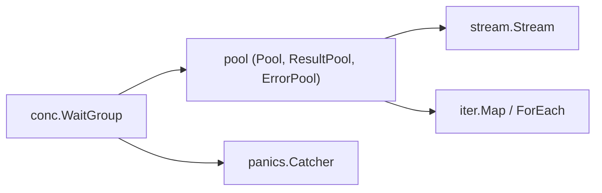

# sourcegraph/conc

> Bibliothèque Go de concurrence structurée : pools, flux ordonnés et récupération de panics.

## Le problème
Lancer des goroutines sans les attendre les fait fuir, et une panic dans l'une plante tout le processus.

## Ce que ça fait vraiment
Une `conc.WaitGroup` sûre, qui fait remonter les panics avec la pile de la goroutine fille au moment du `Wait()`. Des pools (`pool.New`, avec variantes résultat, erreur et contexte), `stream.Stream` pour traiter en parallèle en gardant l'ordre, `iter.Map` et `iter.ForEach` pour parcourir des tranches, et `panics.Catcher`.

## Comment c'est branché


## Essayer
```bash
go get github.com/sourcegraph/conc
```

## Coût et pièges
Gratuit. Le README annonce une version pré-1.0 avec 1.0 visé en mars 2023 : il n'a pas été mis à jour depuis, donc l'état de stabilité réel est à vérifier.

## Ce que ce n'est pas
Pas un framework d'orchestration : c'est une petite boîte à outils autour de `sync.WaitGroup` et des canaux. Elle ne remplace pas les bibliothèques de messagerie.

## Alternatives
Aucune alternative nommée dans le README (il compare seulement avec la bibliothèque standard).

## Pour toi
À ignorer sauf si tu écris du Go concurrent : rien pour du Python data/IA, et son README d'origine n'est plus à jour.

