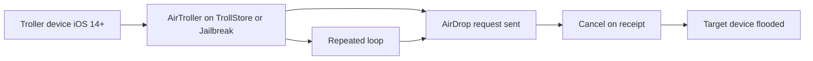

# sourcelocation/AirTroller

> **A Swift prank tool that floods a nearby iPhone with a burst of AirDrop requests.**

## The problem

Without this tool, flooding an Apple device with AirDrop popups means firing off the send
by hand over and over. The README frames it as a joke among friends, not a serious need:
it is a trolling toy, not a utility with a stated problem to solve.

## What it actually does

Per the README, AirTroller sends AirDrop requests in a loop "until the receiving device
explodes." Its method: fire a request and cancel it right as the target receives it. That is
the claimed difference from TrollDrop, which broke on iOS 12-13 once Apple introduced
"auto-decline." The author says it was tested on iOS 14 to 15.7.1 targets. The README
documents no installation, no build, and no detailed usage.

## How it is wired



The README provides no diagram and no file names. The graph above infers the pieces from the
prose alone: a sending device with TrollStore or a jailbreak runs AirTroller, which sends an
AirDrop request then cancels it on receipt, in a loop, until the target device is swamped.
Nothing else is described.

## Trying it

```bash
# No install, build, or usage command is documented in the README.
# The README only states: troller on iOS 14+ with TrollStore or Jailbreak;
# the victim device must also run iOS 14+.
```

The README documents no command: there is nothing to copy. It only points to a Discord server.

## Cost and traps

Free and no API key. But the sending device must be jailbroken or have TrollStore, and the
target must run iOS 14+ — the README stresses this. The main trap is not technical: an
explicit disclaimer clears the author of any responsibility and claims an "educational
purposes only" intent. Sending this at a third party's device without consent is abusive use
the author disavows.

## What it is not

This is not a legitimate tool or a useful production project: it is a prank AirDrop spammer.
It is also not cross-platform — it targets iOS only, with jailbreak or TrollStore. Nothing
suggests it works past iOS 15.7.1, and the device "exploding" is a figure of speech, not a
measured capability.

## Alternatives

The README cites **midnightchip/trolldrop** (MIT) as the predecessor, broken since iOS 12-13
because of Apple's auto-decline — AirTroller sets itself apart with its cancel method. None of
the catalog neighbors (bitwarden/ios, permissionlesstech/bitchat, airbnb/lottie-ios,
ReactiveX/RxSwift) is comparable.

## For you

For a data / AI / MLOps profile, no value: move on. It is an iOS prank, unrelated to serious
software engineering, under a copyleft license and carried by a single person.
