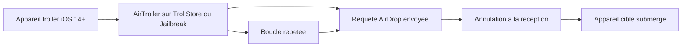

# sourcelocation/AirTroller

> **Outil de farce en Swift qui noie un iPhone voisin sous des requêtes AirDrop en rafale.**

## Le problème

Sans cet outil, saturer un appareil Apple de fenêtres AirDrop demande de relancer l'envoi à
la main. Le README présente ça comme une blague entre amis, pas comme un besoin sérieux :
c'est un jouet de trolling, pas un utilitaire à problème identifié.

## Ce que ça fait vraiment

D'après le README, AirTroller envoie des demandes AirDrop en boucle « jusqu'à ce que
l'appareil qui reçoit explose ». Sa méthode : émettre une requête puis l'annuler juste au
moment où la cible la reçoit. C'est la différence revendiquée avec TrollDrop, qui cassait sur
iOS 12-13 quand Apple a introduit l'« auto-decline ». Testé, dit l'auteur, sur des cibles
iOS 14 à 15.7.1. Le README ne documente ni installation, ni compilation, ni usage détaillé.

## Comment c'est branché



Le README ne fournit pas de diagramme ni de noms de fichiers. Le schéma ci-dessus déduit les
pièces de la seule prose : un appareil émetteur sous TrollStore ou jailbreak fait tourner
AirTroller, qui envoie une requête AirDrop puis l'annule à la réception, en boucle, jusqu'à
noyer l'appareil cible. Rien d'autre n'est décrit.

## Essayer

```bash
# Aucune commande d'installation, de build ni d'usage n'est documentée dans le README.
# Le README indique seulement : troller sous iOS 14+ avec TrollStore ou Jailbreak ;
# la cible doit aussi être sous iOS 14+.
```

Le README ne documente aucune commande : il n'y a rien à copier. Il renvoie seulement à un
serveur Discord.

## Coût et pièges

Gratuit et sans clé d'API. Mais l'appareil émetteur doit être jailbreaké ou disposer de
TrollStore, et la cible tourner sous iOS 14+ — le README insiste sur ce point. Le piège
principal n'est pas technique : un avertissement explicite décharge l'auteur de toute
responsabilité et rappelle un usage « à but éducatif uniquement ». Envoyer ça sur l'appareil
d'un tiers sans accord est un usage abusif que l'auteur désavoue.

## Ce que ce n'est pas

Ce n'est pas un outil légitime ni un projet utile en production : c'est un spammer AirDrop de
farce. Ce n'est pas non plus multiplateforme — cela vise uniquement iOS avec jailbreak ou
TrollStore. Rien n'indique que ça fonctionne au-delà d'iOS 15.7.1, et l'« explosion » de
l'appareil est un raccourci de langage, pas une capacité mesurée.

## Alternatives

Le README cite **midnightchip/trolldrop** (MIT) comme le prédécesseur, cassé depuis iOS 12-13
à cause de l'auto-decline d'Apple — AirTroller s'en distingue par sa méthode d'annulation.
Aucun des voisins du catalogue (bitwarden/ios, permissionlesstech/bitchat, airbnb/lottie-ios,
ReactiveX/RxSwift) n'est comparable.

## Pour toi

Pour un profil data / IA / MLOps, aucun intérêt : passe ton chemin. C'est une farce iOS, sans
lien avec l'ingénierie logicielle sérieuse, sous licence copyleft et porté par une seule
personne.
