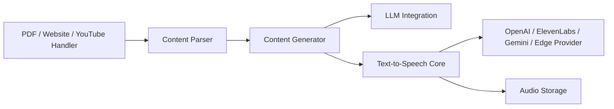

# souzatharsis/podcastfy

> Bibliothèque Python qui transforme pages web, PDF, images ou vidéos en podcast conversationnel.

## Le problème
Les outils fermés type NotebookLM ne permettent ni personnalisation, ni automatisation, ni génération à l'échelle.

## Ce que ça fait vraiment
Extraction de contenu (sites, PDF, YouTube, images) puis génération d'un dialogue par un LLM (100+ modèles, dont locaux).
Synthèse vocale via OpenAI, Google, ElevenLabs ou Edge ; format court ou long (30 min+), multilingue.
Configuration du style, des voix et de la structure par YAML.
Utilisable en Python, CLI ou API FastAPI (bêta).

## Comment c'est branché


## Essayer
```bash
pip install podcastfy
python -m podcastfy.client --url <url1> --url <url2>
```

## Coût et pièges
Clés LLM et TTS à ta charge (ElevenLabs peut coûter cher) ; ffmpeg requis.
Qualité audio dépendante du fournisseur TTS.

## Ce que ce n'est pas
Pas un produit fini type NotebookLM avec interface soignée.
Pas un outil de montage audio.

## Alternatives
- NotebookLM : outil fermé de Google, pour la synthèse de recherche en interface.
- OpenNotebook, SurfSense : projets construits sur Podcastfy.

## Pour toi
À surveiller : pratique pour transformer docs ou papiers en audio, projet d'une personne mais adopté par d'autres outils.
