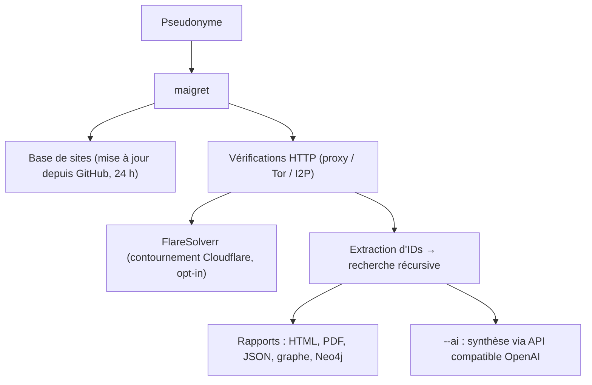

# soxoj/maigret

> Outil OSINT qui constitue un dossier sur une personne à partir d'un simple pseudonyme.

## Le problème
Retrouver les comptes liés à un pseudonyme suppose sinon des centaines de recherches manuelles,
site par site, sans recoupement des informations trouvées.

## Ce que ça fait vraiment
Interroge 5 900 sites ; une exécution par défaut couvre les 500 mieux classés par trafic, `-a`
élargit à tout, `--tags` filtre par catégorie ou pays. Aucune clé d'API n'est requise.
Extrait des pages de profil et des API tout ce qui est disponible sur le titulaire, y compris
les liens vers d'autres comptes, puis relance une recherche récursive sur les identifiants trouvés.
Détecte et contourne partiellement blocages, censure et CAPTCHA ; fonctionne avec Tor et I2P.
Sort des rapports en PDF, HTML, CSV, TXT, JSON, graphe D3 interactif, XMind et script Cypher Neo4j.
S'importe comme bibliothèque Python, et propose une interface web et un mode `--ai` de synthèse.

## Comment c'est branché


## Essayer
```bash
pip install maigret
maigret YOUR_USERNAME
maigret user --html
maigret user --tags photo,dating
docker run -p 5000:5000 soxoj/maigret:web
export OPENAI_API_KEY=sk-... && maigret user --ai
```

## Coût et pièges
Gratuit, MIT, y compris pour un usage commercial. Python 3.10 minimum. Le mode `--ai` envoie le
rapport interne à une API compatible OpenAI : clé à ta charge, et données transmises à un tiers.
Le contournement Cloudflare est expérimental et demande un FlareSolverr local. La base publique
de sites se dégrade avec le temps ; la version à jour quotidiennement est un service payant.

## Ce que ce n'est pas
Ce n'est pas neutre juridiquement : le README rappelle que l'usage est éducatif et licite
uniquement, et que le RGPD reste ta responsabilité. Ce n'est pas exhaustif : la détection casse
quand les sites changent. L'instance web déployable en un clic n'a aucune authentification.

## Alternatives
Aucune alternative nommée dans le README.

## Pour toi
Hors métier, sauf usage défensif : vérifier ce qu'un pseudonyme professionnel laisse voir.
