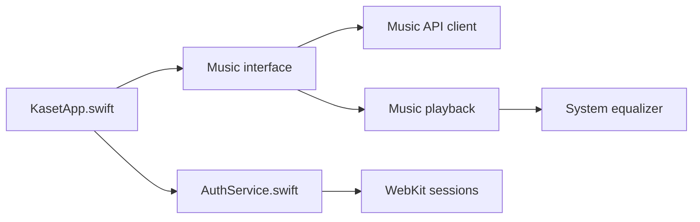

# sozercan/kaset

> Client macOS natif non officiel pour YouTube Music et YouTube, avec égaliseur et paroles.

## Le problème
YouTube Music n'a pas de vraie application macOS native intégrée au système.

## Ce que ça fait vraiment
Application macOS (15.4+) qui lit YouTube Music (contenu protégé via un abonnement Premium) et YouTube avec contrôles natifs. Égaliseur 6 bandes, paroles synchronisées, file d'attente, mélange intelligent, bibliothèque, podcasts, raccourcis, AppleScript et schéma d'URL `kaset://`. Fonctions IA sur l'appareil à partir de macOS 26.

## Comment c'est branché


## Essayer
```bash
brew install sozercan/repo/kaset
xattr -cr /Applications/Kaset.app
```

## Coût et pièges
Gratuit, mais compte Google et abonnement Premium pour la lecture protégée. L'application n'est pas signée.

## Ce que ce n'est pas
Pas un produit Google : non affilié, il repose sur le service tiers. Réservé à macOS.

## Alternatives
Aucune alternative nommée dans le README.

## Pour toi
À ignorer : application grand public macOS sans lien avec data, IA ou MLOps.

