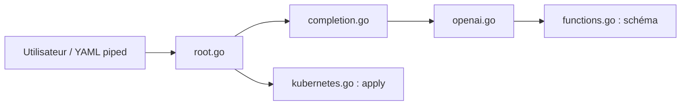

# sozercan/kubectl-ai

> Plugin kubectl qui génère et applique des manifestes Kubernetes à partir d'une phrase, via OpenAI.

## Le problème
Écrire un manifeste pour tester vite une idée oblige à chercher des exemples épars.

## Ce que ça fait vraiment
Envoie la demande (et un YAML éventuel en entrée) à un modèle OpenAI, Azure OpenAI ou compatible, affiche le manifeste, puis propose Réessayer, Appliquer ou Annuler. Avec `--use-k8s-api`, il consulte le schéma OpenAPI du cluster (CRD inclus) par appel de fonction. Mode `--raw` pour les pipes.

## Comment c'est branché


## Essayer
```bash
brew tap sozercan/kubectl-ai https://github.com/sozercan/kubectl-ai
brew install kubectl-ai
kubectl ai "create an nginx deployment with 3 replicas"
```

## Coût et pièges
Clé OpenAI, Azure OpenAI ou endpoint compatible (AIKit, LocalAI) ; le mode schéma consomme plus d'appels. La confirmation avant application est active par défaut.

## Ce que ce n'est pas
Pas conscient de l'état du cluster : il génère toujours un manifeste complet, comme le dit le README. Dernier push en janvier 2025 et modèle par défaut ancien (`gpt-3.5-turbo-0301`).

## Alternatives
Aucune alternative nommée dans le README.

## Pour toi
À ignorer : peu maintenu, modèles par défaut dépassés et génération sans connaissance du cluster ; relis toujours un manifeste avant `apply`.

