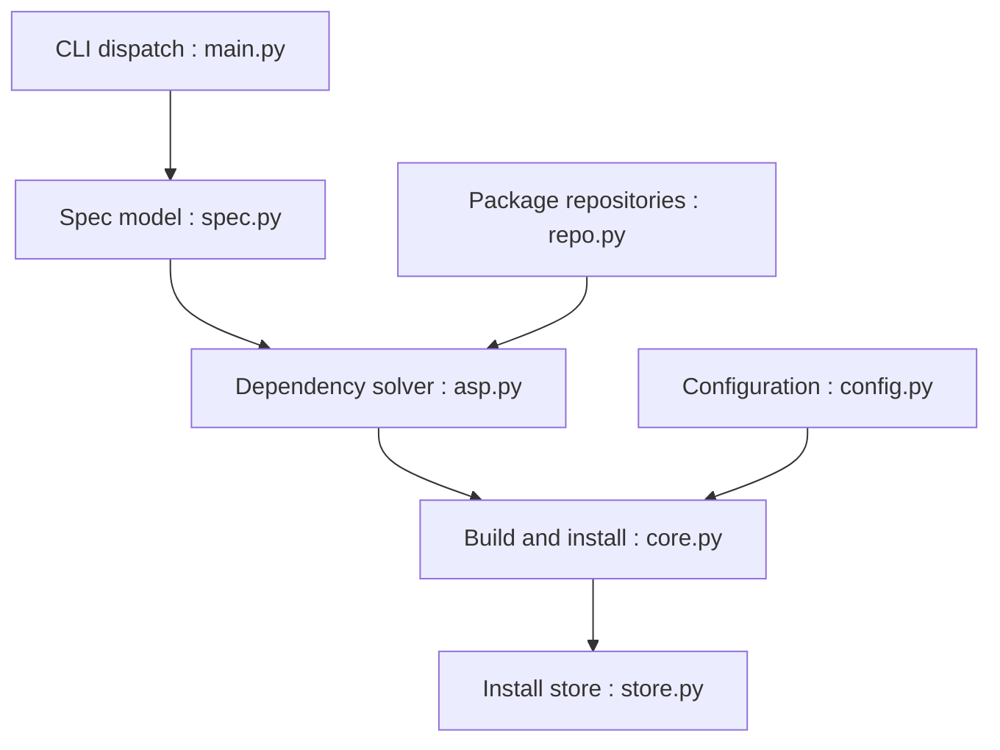

# spack/spack

> Gestionnaire de paquets multi-plateforme qui compile plusieurs versions et configurations d'un logiciel, pensé pour le calcul haute performance.

## Le problème
Sur supercalculateurs, un même logiciel doit exister en plusieurs versions, compilateurs et options sans casser les installations existantes.

## Ce que ça fait vraiment
Une syntaxe de « spec » décrit version et options. Spack résout les dépendances, compile et installe dans un store non destructif où plusieurs configurations coexistent. Les recettes sont écrites en Python. Il tourne sous Linux, macOS, Windows et sur des supercalculateurs.

## Comment c'est branché


## Essayer
```bash
git clone --depth=2 https://github.com/spack/spack.git
. spack/share/spack/setup-env.sh
spack install zlib-ng
spack help --all
```

## Coût et pièges
Gratuit. Python et Git requis. Les builds depuis les sources peuvent être longs ; le README cite des caches binaires sans détailler leur usage ici. 1 804 issues ouvertes.

## Ce que ce n'est pas
Pas un gestionnaire de paquets Python comme pip : il construit des logiciels natifs. Les recettes communautaires sont dans un autre dépôt (spack-packages).

## Alternatives
- spack/spack-packages : c'est là qu'on contribue les recettes, pas dans ce dépôt.

## Pour toi
À surveiller : pertinent si tu gères des environnements HPC ou GPU reproductibles ; superflu si Docker et conda te suffisent.

