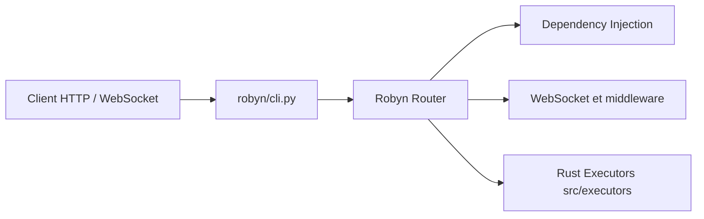

# sparckles/Robyn

> Framework web Python à runtime Rust pour construire des API asynchrones, pour développeurs backend.

## Le problème
Les frameworks web Python classiques plafonnent en débit ; on veut une API Python simple avec un cœur plus rapide.

## Ce que ça fait vraiment
Serveur HTTP dont le runtime est en Rust, piloté depuis Python : routage dynamique, WebSockets, middlewares, injection de dépendances, OpenAPI généré automatiquement, SSE, fichiers statiques, Jinja2, scaffolding CLI. Le README annonce aussi un support d'agents IA et de MCP, sans détail.

## Comment c'est branché


## Essayer
```bash
pip install robyn
```
```python
from robyn import Robyn

app = Robyn(__file__)

@app.get("/")
async def h(request):
    return "Hello, world!"

app.start(port=8080)
```
```bash
python3 app.py
```

## Coût et pièges
Gratuit. Pour contribuer, il faut Python 3.10 à 3.14, Rust stable et un compilateur C (maturin). Le support io-uring est marqué expérimental.

## Ce que ce n'est pas
Pas un framework « batteries incluses » : l'accès aux données passe par des gabarits de scaffolding (SQLAlchemy, Prisma, Mongo…), pas par un ORM intégré. Le classement TechEmpower cité est celui de l'auteur.

## Alternatives
Aucune alternative nommée dans le README.

## Pour toi
À surveiller : pertinent si tu exposes des modèles derrière une API et que la latence compte, mais rien ne prouve dans le README qu'il fasse mieux que ta stack actuelle pour ton cas.

