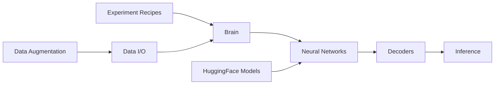

# speechbrain/speechbrain

> Toolkit PyTorch pour la parole, le texte et l'EEG : recettes d'entraînement et modèles pré-entraînés.

## Le problème
Chaque tâche audio (ASR, locuteur, séparation, TTS) a son propre code de recherche, difficile à comparer et réutiliser.

## Ce que ça fait vraiment
Plus de 200 recettes sur 40+ jeux de données pour 20 tâches : ASR, reconnaissance du locuteur, séparation, rehaussement, TTS, SLU, diarisation, EEG…
Classe `Brain` pour les boucles d'entraînement, hyperparamètres en YAML, multi-GPU, précision mixte, batching dynamique.
100+ modèles sur Hugging Face avec interfaces d'inférence en trois lignes.
Intégrations Hugging Face (wav2vec2, Whisper), Orion, k2, WebDataset.

## Comment c'est branché


## Essayer
```bash
pip install speechbrain
git clone https://github.com/speechbrain/speechbrain.git
cd speechbrain
pip install -r requirements.txt
pip install --editable .
pytest tests
```

## Coût et pièges
Gratuit, Apache-2.0 ; GPU nécessaire pour entraîner, logs et checkpoints de recettes hébergés sur Dropbox.

## Ce que ce n'est pas
Pas un service d'API de transcription clé en main.
Orienté recherche : la mise en production temps réel est un objectif futur (« scale down »).

## Alternatives
Aucune alternative nommée dans le README.

## Pour toi
À adopter dès qu'un projet touche à l'audio : recettes reproductibles et modèles prêts évitent de repartir du code de papier.
