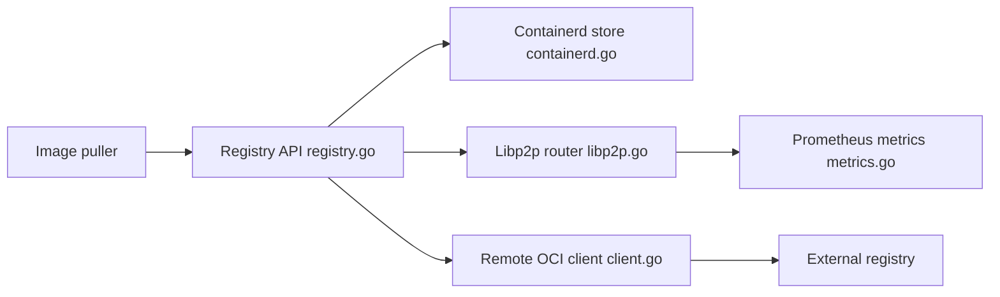

# spegel-org/spegel

> Miroir de registre d'images OCI sans état pour clusters Kubernetes, qui partage le cache entre nœuds.

## Le problème
Les tirages d'images depuis des registres externes sont lents, limités en débit (Docker Hub) et échouent si le registre tombe.

## Ce que ça fait vraiment
Le README est très court. D'après le code : Spegel sert une API de registre qui répond depuis le stockage containerd local, sinon depuis des pairs ou le registre externe ; la disponibilité du contenu est partagée via libp2p. Il expose aussi des métriques Prometheus et une interface web.

## Comment c'est branché

## Essayer
Aucune commande dans le README : il renvoie vers un guide de démarrage. Commande non documentée ici.

## Coût et pièges
Suppose un cluster Kubernetes avec containerd. Le projet précise : API évolutive, pas de support garanti, aide au mieux, orienté home lab et contributeurs individuels.

## Ce que ce n'est pas
Pas un registre autonome ni une solution à support commercial. Matière du README insuffisante pour juger au-delà.

## Alternatives
Aucune alternative nommée dans le README.

## Pour toi
À surveiller : pertinent seulement si tu opères un cluster Kubernetes et veux économiser du débit d'images ; sinon sans intérêt.

