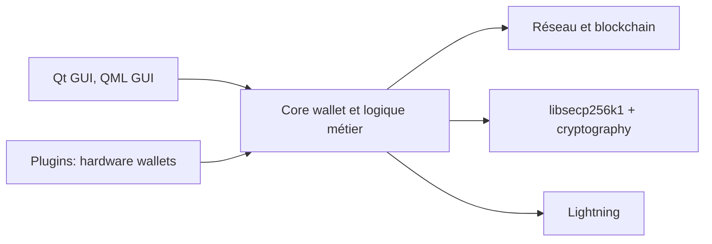

# spesmilo/electrum

> Portefeuille Bitcoin léger en Python, avec interfaces Qt et QML.

## Le problème
Détenir et dépenser des bitcoins sans télécharger toute la chaîne de blocs.

## Ce que ça fait vraiment
Le README décrit surtout l'installation depuis les sources et les tests. D'après l'architecture décrite d'après le code : cœur de portefeuille (wallet, transactions, réseau), interfaces Qt et QML, cryptographie via libsecp256k1 et `cryptography`, plugins de portefeuilles matériels (Trezor, Ledger, Coldcard), et modules Lightning. Des scripts de build produisent tarball, AppImage, macOS, Windows et Android.

## Comment c'est branché


## Essayer
```bash
sudo apt-get install libsecp256k1-dev
ELECTRUM_ECC_DONT_COMPILE=1 python3 -m pip install --user ".[gui,crypto]"
./run_electrum
pytest tests -v
```

## Coût et pièges
Gratuit. Python 3.10+, libsecp256k1 (compilée ou fournie) et PyQt6 pour l'interface Qt. 1 241 issues ouvertes. Un portefeuille manipule des fonds : n'installer que depuis la source officielle.

## Ce que ce n'est pas
Ce n'est pas un nœud complet ni un outil d'analyse de données de blockchain. Le README ne détaille pas les fonctions du produit.

## Alternatives
Aucune alternative nommée dans le README.

## Pour toi
Ignorer : portefeuille crypto sans lien avec le travail data/IA/MLOps.

