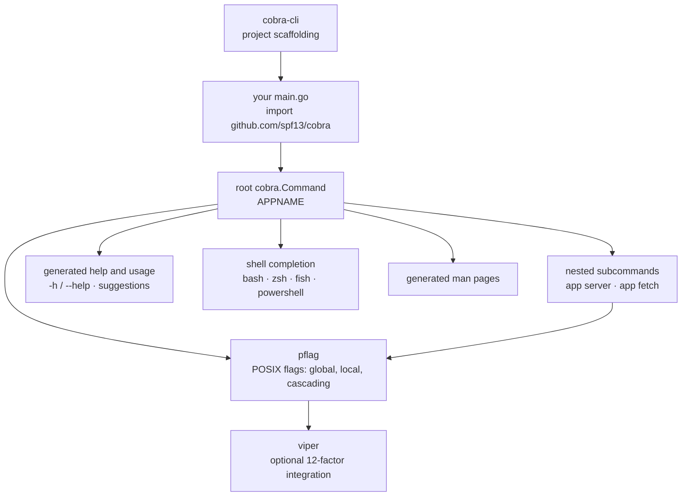

# spf13/cobra

> **Go library for building a command-line interface with subcommands, flags and generated help.**

## The problem

Building a subcommand binary on top of the standard library's `flag` package means hand-rolling
the `app server` routing, short and long flags, option inheritance between commands, the help
text and shell completion. Every in-house tool ends up with its own half-implementation,
inconsistent with the next one.

## What it actually does

Cobra provides the three-part structure the README describes: **Commands** (actions), **Args**
(things) and **Flags** (modifiers for those actions), following the `APPNAME VERB NOUN --ADJECTIVE`
pattern — the one behind `hugo server --port=1313` and `git clone URL --bare`.

In practice the library handles nested subcommands, POSIX-compliant flags (short and long forms)
through [pflag](https://github.com/spf13/pflag), global, local and cascading flags, command
aliases, and suggestions (`app srver` → "did you mean `app server`?").

It also generates what nobody writes by hand: help for commands and flags, grouped help for
subcommands, automatic recognition of `-h` / `--help`, man pages, and shell completion for bash,
zsh, fish and powershell. Help and usage remain overridable.

Project scaffolding is not part of the library: it lives in a separate binary, `cobra-cli`, which
generates the application and its command files. Integration with
[viper](https://github.com/spf13/viper) for configuration is presented as optional.

## How it is wired

No code-derived diagram exists for this repository; the graph below is reconstructed from the
README alone, using its own vocabulary.



## Trying it

```bash
go get -u github.com/spf13/cobra@latest
```

```go
import "github.com/spf13/cobra"
```

Then, for the scaffolding tool:

```bash
go install github.com/spf13/cobra-cli@latest
```

The README documents nothing further, pointing instead to the user guide
(`site/content/user_guide.md`), the cobra-cli README and cobra.dev. There is no complete code
example in it, so there is nothing else to copy.

## Cost and gotchas

No API key, no GPU, no third-party service, no account to create: it is a Go library compiled into
your binary, under the Apache 2.0 licence. The cost lies elsewhere.

- **Two de facto dependencies**: `pflag` (a fork of the standard `flag` package) carries flag
  handling, and `cobra-cli` is a second repository to install if you want scaffolding. The
  `cobra` / `pflag` / `viper` trio comes from the same author and travels together.
- **Most of the documentation is outside the README**: cobra.dev, the user guide under
  `site/content/`, the pkg.go.dev reference. The README alone will not get a command written.
- **Structural lock-in**: your command tree becomes a hierarchy of `cobra.Command`. Cheap to
  adopt, less cheap to leave once inherited flags and custom help are in place.

## What it is not

- **Not an application framework or a project generator.** The library parses arguments and emits
  help; skeleton generation is delegated to the separate `cobra-cli`.
- **Not a configuration library**: reading config files or environment variables is viper's job,
  and that integration is explicitly described as optional.
- **Not a terminal UI toolkit**: no colours, no tables, no full-screen interactive interface —
  none of that is claimed.

## Alternatives

| | When to prefer it |
|---|---|
| **spf13/pflag** | Named in the README as the flag provider. Use it alone if your binary has a single command and you only want POSIX flags, without a subcommand tree. |
| **spf13/viper** | Named in the README: complementary rather than competing. Add it when configuration (files, environment) weighs more than command routing. |
| **spf13/cobra-cli** | Named in the README: take it alongside the library if you want the project tree and command files generated for you. |

The catalogue neighbours (`pranshuparmar/witr`, `go-shiori/shiori`, `derailed/k9s`,
`bcicen/ctop`) are command-line applications, not libraries for writing them: no comparable
alternative on that side.

## For you

Adopt it as soon as you ship a data or MLOps tool written in Go: it is the ecosystem's convention,
the one behind Kubernetes, Hugo and the GitHub CLI cited in the README, so the cheapest to hand
over to an ops team. Irrelevant if your tooling is Python — look at that ecosystem's equivalents,
Cobra does not apply there.
