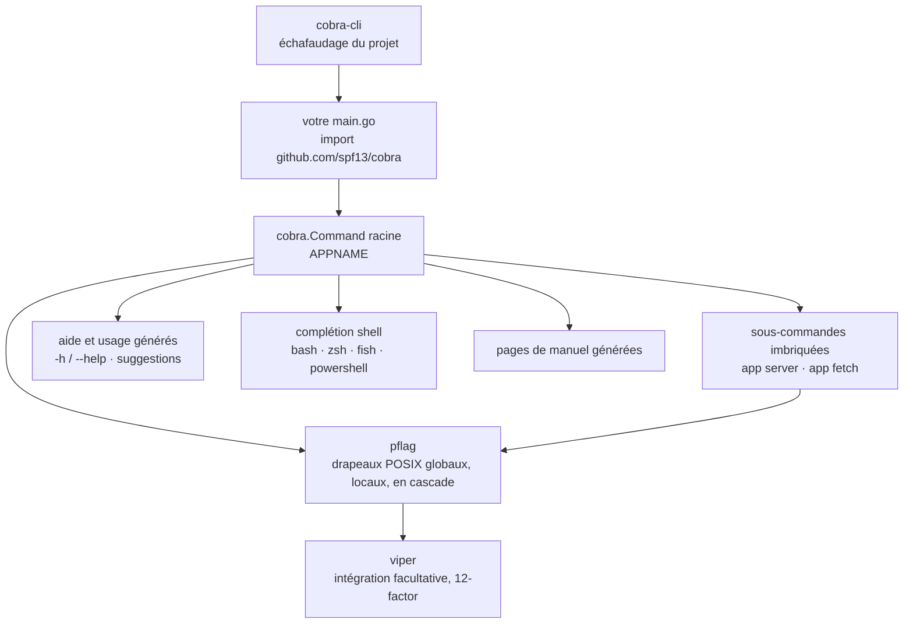

# spf13/cobra

> **Bibliothèque Go pour bâtir une interface en ligne de commande à sous-commandes, drapeaux et aide générée.**

## Le problème

Écrire un binaire à sous-commandes avec le paquet `flag` de la bibliothèque standard oblige à
recoder soi-même le routage `app server`, les drapeaux longs et courts, l'héritage des options
entre commandes, le texte d'aide et la complétion du shell. Chaque outil maison finit avec sa
propre demi-implémentation, incohérente avec celle du voisin.

## Ce que ça fait vraiment

Cobra fournit une structure à trois pièces annoncée par le README : **Commands** (les actions),
**Args** (les choses) et **Flags** (les modificateurs), sur le patron `APPNAME VERB NOUN --ADJECTIVE`,
celui de `hugo server --port=1313` ou `git clone URL --bare`.

Concrètement, la bibliothèque prend en charge : les CLI à sous-commandes imbriquées, les drapeaux
conformes POSIX (versions courte et longue) via [pflag](https://github.com/spf13/pflag), les
drapeaux globaux, locaux et en cascade, les alias de commandes, et la suggestion de correction
(`app srver` → « did you mean `app server`? »).

Elle génère aussi ce qu'on écrit rarement à la main : l'aide des commandes et des drapeaux, le
regroupement de l'aide des sous-commandes, la reconnaissance automatique de `-h` / `--help`, les
pages de manuel, et la complétion pour bash, zsh, fish et powershell. L'aide et l'usage restent
redéfinissables.

L'échafaudage d'un projet n'est pas dans la bibliothèque : c'est un binaire séparé, `cobra-cli`,
qui génère l'application et les fichiers de commandes. L'intégration avec
[viper](https://github.com/spf13/viper) pour la configuration est présentée comme facultative.

## Comment c'est branché

Aucun diagramme tiré du code n'existe pour ce dépôt : ce schéma est reconstruit depuis le seul
README, avec les noms qu'il emploie.



## Essayer

```bash
go get -u github.com/spf13/cobra@latest
```

```go
import "github.com/spf13/cobra"
```

Puis, pour l'échafaudage :

```bash
go install github.com/spf13/cobra-cli@latest
```

Le README n'en documente pas davantage et renvoie au guide utilisateur
(`site/content/user_guide.md`), au README de cobra-cli et au site cobra.dev. Aucun exemple de
code complet n'y figure : il n'y a rien d'autre à copier.

## Coût et pièges

Aucune clé d'API, aucun GPU, aucun service tiers, aucun compte à créer : c'est une bibliothèque
Go compilée dans votre binaire, sous licence Apache 2.0. Le coût est ailleurs.

- **Deux dépendances de fait** : `pflag` (fork du paquet `flag` standard) porte la gestion des
  drapeaux, et `cobra-cli` est un second dépôt à installer si vous voulez l'échafaudage. Le trio
  `cobra` / `pflag` / `viper` vient du même auteur et se tient par la main.
- **L'essentiel de la documentation est hors README** : cobra.dev, le guide utilisateur dans
  `site/content/`, la référence pkg.go.dev. Le README seul ne suffit pas à écrire une commande.
- **Verrouillage de structure** : votre arbre de commandes devient une hiérarchie de
  `cobra.Command`. C'est peu coûteux à adopter, plus coûteux à quitter une fois les drapeaux
  hérités et l'aide personnalisée en place.

## Ce que ce n'est pas

- **Ce n'est pas un cadre d'application ni un générateur de projet.** La bibliothèque analyse les
  arguments et produit l'aide ; la génération de squelette est déportée dans `cobra-cli`, distinct.
- **Ce n'est pas une bibliothèque de configuration** : lire un fichier de config ou des variables
  d'environnement est le travail de viper, intégration explicitement décrite comme facultative.
- **Ce n'est pas une boîte à outils de terminal** : ni couleurs, ni tableaux, ni interface
  interactive plein écran. Rien de tel n'est annoncé.

## Alternatives

| | Quand le préférer |
|---|---|
| **spf13/pflag** | Nommé dans le README comme fournisseur des drapeaux. À préférer seul si votre binaire n'a qu'une commande et que vous voulez juste des drapeaux POSIX, sans arbre de sous-commandes. |
| **spf13/viper** | Nommé dans le README : complémentaire plutôt que concurrent. À ajouter quand la configuration (fichier, environnement) pèse plus que le routage des commandes. |
| **spf13/cobra-cli** | Nommé dans le README : à prendre en plus de la bibliothèque si vous voulez que l'arborescence du projet et les fichiers de commandes soient générés. |

Les voisins du catalogue (`pranshuparmar/witr`, `go-shiori/shiori`, `derailed/k9s`,
`bcicen/ctop`) sont des applications en ligne de commande, pas des bibliothèques pour en écrire :
aucune alternative comparable de ce côté.

## Pour toi

À adopter dès que vous distribuez un outil data ou MLOps écrit en Go : c'est la convention du
milieu, celle de Kubernetes, Hugo et du GitHub CLI cités par le README, donc la moins coûteuse à
faire adopter par une équipe ops. Sans rapport si votre outillage est en Python — regardez du côté
des équivalents de cet écosystème, Cobra ne s'y invoque pas.
