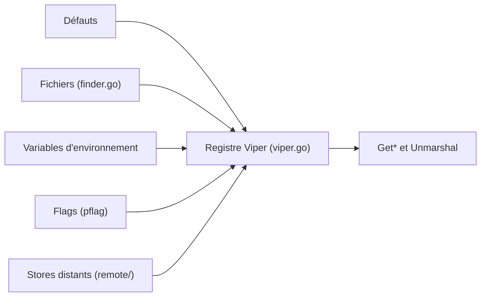

# spf13/viper

> Bibliothèque Go de configuration : fichiers, variables d'environnement, flags et stores distants fusionnés en un registre.

## Le problème
Une application Go lit sa configuration depuis des fichiers, l'environnement, des flags et parfois etcd ou Consul, chacun avec sa logique.

## Ce que ça fait vraiment
Fusionne les sources avec un ordre de priorité fixe : Set explicite, flags, variables d'environnement, fichiers, stores clé/valeur, valeurs par défaut. Elle lit JSON, TOML, YAML, INI, envfile et properties, surveille les changements de fichier, lit etcd, Consul, Firestore ou NATS, gère les alias et désérialise vers des structs. Clés insensibles à la casse et sous-ensembles via Sub.

## Comment c'est branché


## Essayer
```bash
go get github.com/spf13/viper
make test
make lint
```

## Coût et pièges
Gratuit. Pas de fusion profonde : une valeur complexe surchargée remplace l'ensemble. Non sûr en accès concurrent lecture/écriture (panic possible). Le singleton global est déconseillé. Le projet annonce une v2 et privilégie la stabilité aux nouveautés.

## Ce que ce n'est pas
Pas un gestionnaire de secrets : le chiffrement passe par crypt et un keyring GPG optionnel. Ne convient pas si tu veux évoluer vite : les nouveautés attendent la v2.

## Alternatives
Aucune alternative citée dans le README.

## Pour toi
À surveiller : référence pour la configuration d'outils Go, mais sans intérêt direct si ton travail data/IA reste en Python.

