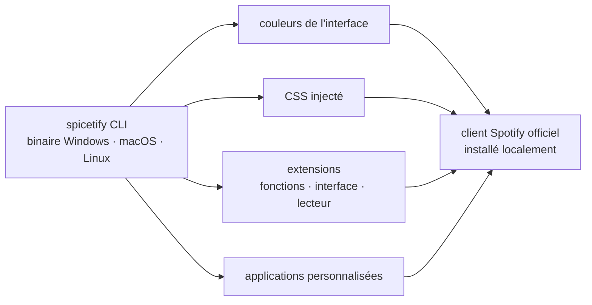

# spicetify/cli

> **A command-line tool that modifies the desktop Spotify client installed on your own machine.**

## The problem

The Spotify desktop client is a closed application: no official themes, no stylesheet hooks, no
plugin system. Anyone who wants to change its look or add a function has no supported entry
point and ends up editing the installed program's resources by hand — work that every client
update undoes.

## What it actually does

Spicetify is a command-line executable that injects modifications into the official Spotify
client. The README lists five capabilities: changing colors across the user interface,
injecting CSS for more advanced customization, injecting extensions that extend
functionality, manipulate the UI and control the player, injecting custom apps, and generally
putting the user in control of the client.

All three desktop operating systems are announced: Windows, macOS and Linux. The repository
publishes tagged releases and a total-downloads counter; code signing is provided free of
charge by SignPath.io, with a certificate from the SignPath Foundation — a detail that only
matters for a binary shipped to end users on Windows.

The README describes neither the injection mechanism nor the format of themes, extensions and
custom apps: it points to the documentation hosted on `spicetify.app`.

## How it is wired



No code-derived diagram exists for this repository: this one is reconstructed from the README
alone, which names the four kinds of injection but not a single file of the repository. The
point to keep is that the target is not a remote service but the local installation of the
official client: everything the tool does stops at the user's own machine.

## Try it

```
# The README gives no installation or usage command.
# It points to two external pages instead:
#   https://spicetify.app/docs/getting-started
#   https://spicetify.app/docs/getting-started#basic-usage
```

Nothing is reconstructed here: the README offers only those two links, so the real procedure
lives outside the repository and could not be checked without network access.

## Cost and pitfalls

- **The Spotify client is a hard prerequisite**, and it does not belong to this project. A
  Spotify account is therefore needed for the tool to have any object; the tool itself costs
  nothing.
- **LGPL-2.1 license** as recorded in the catalogue: weak copyleft. Irrelevant for personal use
  of the binary, worth reading closely before any redistribution or integration.
- **Modifying a proprietary client invites breakage**: every Spotify update may invalidate the
  injections. The README says nothing about version compatibility, nor about Spotify's stance
  on the practice — that is the main unknown.
- **The useful documentation lives outside the repository**, on `spicetify.app`. The README
  alone is not enough to install or configure anything.
- **Support happens on Discord** (link in the README) rather than in the repository issues, at
  least judging by what the README puts forward.

## What it is not

- **It is not a Spotify client.** It plays no music and replaces nothing: it modifies the
  official application, which must already be installed.
- **It is not a way around the subscription.** Nothing in the README concerns account
  restrictions; the listed capabilities are about the interface and extensions.
- **It is not a library or an API.** It is an executable you run, not a package you import; the
  README documents no programmatic interface.
- **It is not a theme catalogue.** The repository provides the injection mechanism; the themes,
  extensions and custom apps themselves are not described here.

## Alternatives

No comparable alternative in the catalogue. The proposed neighbours — `ayn2op/discordo`,
`go-shiori/shiori`, `rorkai/App-Store-Connect-CLI`, `ankitpokhrel/jira-cli` — are command-line
tools for Discord, bookmarks, the App Store and Jira: the match is lexical ("CLI"), not
functional, and none of them touches the Spotify client. The README itself names no competing
project.

## For you

No professional value for a data / AI / MLOps profile: this is a comfort tool for a mainstream
desktop application, unrelated to data, models or deployment. Worth a look only as an
engineering curiosity — how a long-lived community project wedges itself into a proprietary
binary — or for your own Spotify use. Otherwise, walk past.
