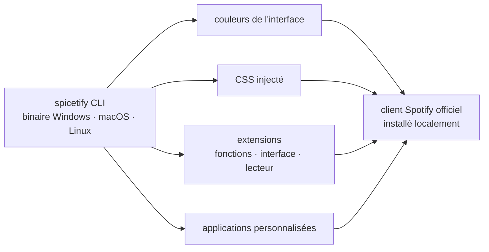

# spicetify/cli

> **Outil en ligne de commande qui modifie le client Spotify de bureau installé sur sa machine.**

## Le problème

Le client Spotify de bureau est une application fermée : ni thème, ni feuille de style, ni
greffon officiels. Qui veut en changer l'apparence ou y ajouter une fonction n'a aucun point
d'entrée prévu, et doit aller modifier à la main les ressources du logiciel installé — une
opération que chaque mise à jour du client défait.

## Ce que ça fait vraiment

Spicetify est un exécutable en ligne de commande qui injecte des modifications dans le client
Spotify officiel. Le README énumère cinq capacités : changer les couleurs de l'interface,
injecter du CSS pour une personnalisation plus poussée, injecter des extensions qui ajoutent
des fonctionnalités, manipulent l'interface et pilotent le lecteur, injecter des applications
personnalisées, et de façon générale « reprendre le contrôle » du client.

Les trois systèmes d'exploitation de bureau sont annoncés : Windows, macOS et Linux. Le dépôt
publie des versions étiquetées et un compteur de téléchargements ; la signature de code est
fournie gracieusement par SignPath.io, avec un certificat de la SignPath Foundation — mention
qui n'a de sens que pour un binaire distribué aux utilisateurs finaux sous Windows.

Le README ne décrit ni le mécanisme d'injection, ni le format des thèmes, extensions et
applications personnalisées : il renvoie à la documentation du site `spicetify.app`.

## Comment c'est branché



Aucun diagramme tiré du code n'existe pour ce dépôt : ce schéma est reconstruit depuis le seul
README, qui nomme les quatre types d'injection mais aucun fichier du dépôt. Le point à retenir
est que la cible n'est pas un service distant mais l'installation locale du client officiel :
tout ce que fait l'outil s'arrête au poste de l'utilisateur.

## Essayer

```
# Aucune commande d'installation ni d'usage n'est donnée dans le README.
# Il renvoie vers deux pages externes :
#   https://spicetify.app/docs/getting-started
#   https://spicetify.app/docs/getting-started#basic-usage
```

Rien n'est reconstruit ici : le README se contente de ces deux liens, la procédure réelle est
hors dépôt et n'a pas pu être vérifiée sans accès réseau.

## Coût et pièges

- **Le client Spotify est un prérequis non négociable**, et il n'appartient pas au projet. Un
  compte Spotify est donc nécessaire pour que l'outil ait un objet ; l'outil lui-même ne coûte
  rien.
- **Licence LGPL-2.1** relevée dans le catalogue : copyleft faible. Sans incidence pour un
  usage personnel du binaire, à regarder de près pour toute redistribution ou intégration.
- **Modifier un client propriétaire expose à la rupture** : chaque mise à jour de Spotify peut
  invalider les injections. Le README ne dit rien de la compatibilité entre versions ni de la
  position de Spotify sur cette pratique — c'est l'inconnue principale.
- **La documentation utile est hors dépôt**, sur `spicetify.app`. Le README seul ne suffit pas
  à installer ni à configurer quoi que ce soit.
- **Le support se fait sur Discord** (lien dans le README), pas dans les issues du dépôt selon
  ce que le README met en avant.

## Ce que ce n'est pas

- **Ce n'est pas un client Spotify.** Il ne lit pas de musique et ne remplace rien : il modifie
  l'application officielle, qu'il faut avoir installée par ailleurs.
- **Ce n'est pas un contournement de l'abonnement.** Rien dans le README ne concerne les
  restrictions du compte ; les capacités listées portent sur l'interface et les extensions.
- **Ce n'est pas une bibliothèque ni une API.** C'est un exécutable qu'on lance, pas un paquet
  qu'on importe ; le README ne documente aucune interface programmatique.
- **Ce n'est pas un catalogue de thèmes.** Le dépôt fournit le mécanisme d'injection ; les
  thèmes, extensions et applications personnalisées ne sont pas décrits ici.

## Alternatives

Aucune alternative comparable dans le catalogue. Les voisins proposés — `ayn2op/discordo`,
`go-shiori/shiori`, `rorkai/App-Store-Connect-CLI`, `ankitpokhrel/jira-cli` — sont des outils
en ligne de commande pour Discord, les marque-pages, l'App Store et Jira : le rapprochement est
lexical (« CLI »), pas fonctionnel, et aucun ne touche au client Spotify. Le README, de son
côté, ne nomme aucun projet concurrent.

## Pour toi

Aucun intérêt professionnel pour un profil data / IA / MLOps : c'est un outil de confort
personnel sur une application de bureau grand public, sans lien avec les données, les modèles
ou le déploiement. À regarder seulement comme curiosité d'ingénierie — la manière dont un
projet communautaire durable s'insère dans un binaire propriétaire — ou pour son propre usage
de Spotify. Sinon, passer son chemin.
