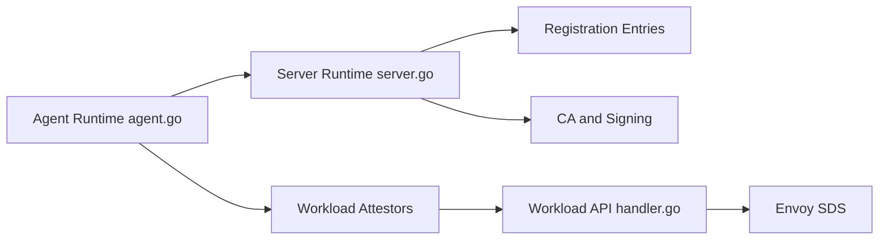

# spiffe/spire

> Système d'identité de charges de travail SPIFFE : serveur et agents qui délivrent des identités vérifiables.

## Le problème
Des services doivent s'authentifier entre eux (mTLS, JWT) sans secrets statiques ni dépendance à une plateforme d'hébergement précise.

## Ce que ça fait vraiment
Un serveur et des agents attestent les nœuds puis les charges de travail, et délivrent des SVID X.509 ou JWT via l'API Workload. Compatible avec Envoy via SDS, avec fédération de bundles de confiance et un cadre de plugins extensible. Projet CNCF gradué ; audits Cure53 (2021) et SIG-Security cités.

## Comment c'est branché


## Essayer
```bash
# Aucune commande dans le README : releases sur
# https://github.com/spiffe/spire/releases ; guides de démarrage Kubernetes, Linux, macOS
```

## Coût et pièges
Gratuit. Demande un déploiement serveur + agents et une réflexion d'architecture ; le README renvoie au guide de passage à l'échelle.

## Ce que ce n'est pas
Pas un gestionnaire de secrets ni un maillage de services : le README renvoie à une page de comparaison. Pas un outil à essayer en cinq minutes.

## Alternatives
Aucune alternative nommée dans le README.

## Pour toi
À surveiller : pertinent pour sécuriser des services MLOps sur Kubernetes, mais surdimensionné pour un petit projet.

