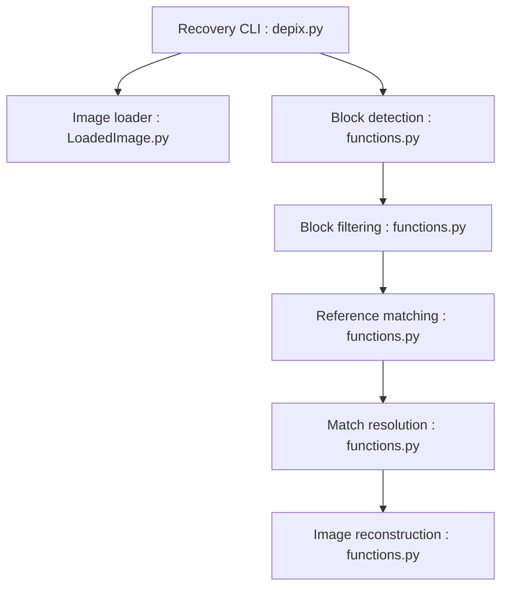

# spipm/Depixelization_poc

> Preuve de concept en ligne de commande pour retrouver du texte pixellisé en comparant des blocs à une image de référence.

## Le problème
Du texte masqué par pixellisation peut parfois être reconstruit.

## Ce que ça fait vraiment
Le README ne dit que « Migrated to codeberg.org/spipm/Depixelization_poc ». D'après le code (GitDiagram) : charge l'image pixellisée et une image de recherche, détecte et filtre des blocs, cherche des correspondances, les résout géométriquement et écrit l'image reconstruite. Un générateur de pixellisation et un outil d'affichage des boîtes existent.

## Comment c'est branché


## Essayer
```bash
# Aucune commande documentée dans le README (il ne contient qu'un lien de migration).
```

## Coût et pièges
Dépôt archivé, développement déplacé sur Codeberg. README vide de contenu technique : matière insuffisante.

## Ce que ce n'est pas
Pas un outil maintenu ici. Pas de garantie de récupération : preuve de concept.

## Alternatives
- Le dépôt Codeberg indiqué par le README : c'est là que vit désormais le projet.

## Pour toi
À ignorer ici : archivé et sans documentation ; si le sujet t'intéresse (risque de fuite par pixellisation), va sur Codeberg.

