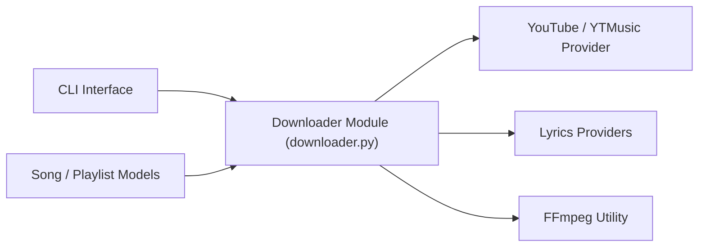

# spotDL/spotify-downloader

> Outil en ligne de commande qui retrouve sur YouTube les titres d'une playlist Spotify et les télécharge.

## Le problème
Garder hors ligne ses playlists Spotify avec métadonnées, pochettes et paroles est impossible via l'application elle-même.

## Ce que ça fait vraiment
À partir d'URL Spotify, il lit les métadonnées, cherche l'audio correspondant sur YouTube via yt-dlp, télécharge avec FFmpeg et intègre pochettes, paroles et tags. Opérations : `download`, `save`, `sync`, `url`, `meta`, `web`. Les fournisseurs de paroles (Genius, Musixmatch, AZLyrics) sont modulaires. Le débit audio est celui de YouTube : 128 kbps, 256 pour YouTube Music premium.

## Comment c'est branché


## Essayer
```bash
pip install spotdl
spotdl --download-ffmpeg
spotdl [urls]
docker run --rm -v $(pwd):/music spotdl download [trackUrl]
```

## Coût et pièges
Gratuit. FFmpeg obligatoire ; Deno recommandé pour certaines vidéos. Le README avertit que les utilisateurs sont responsables des conséquences juridiques et n'encourage pas le téléchargement non autorisé de contenu protégé.

## Ce que ce n'est pas
Ce n'est pas un téléchargement depuis Spotify : la source est YouTube. L'interface web est limitée aux titres individuels.

## Alternatives
- Aucune alternative nommée dans le README.

## Pour toi
Ignorer : usage de loisir avec risque juridique lié aux droits d'auteur, et aucun lien avec le travail data/IA.

