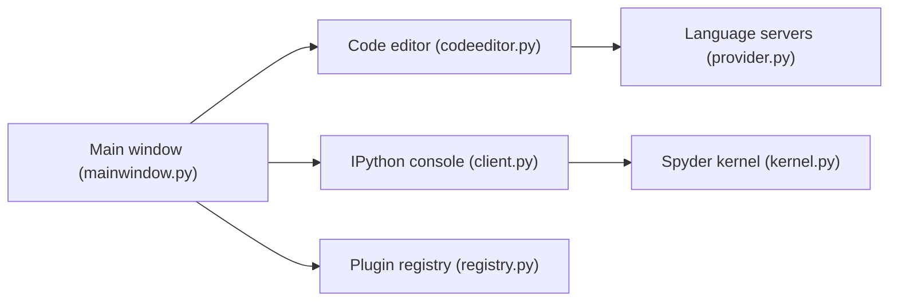

# spyder-ide/spyder

> Environnement de développement Python de bureau pour scientifiques, ingénieurs et analystes de données.

## Le problème
Explorer des données en Python demande d'unir éditeur, console interactive, inspection de variables et débogage dans un seul outil.

## Ce que ça fait vraiment
IDE Qt (PyQt5) avec éditeur multi-langage (analyse pyflakes/pylint, complétion jedi/rope via serveurs de langage), consoles IPython multiples, explorateur de variables (NumPy, pandas, images), visionneuse de documentation Sphinx, débogueur, profileur, projets et recherche dans les fichiers. Système de plugins extensible.

## Comment c'est branché

## Essayer
Le README ne donne pas de commande, seulement la méthode recommandée : installer via Anaconda et `conda`. Alternatives listées : pip, WinPython, MacPorts, gestionnaires de paquets Linux.

## Coût et pièges
Gratuit. Support limité hors installation Anaconda, selon le README. Python 3.11+ et PyQt5 5.15+ requis. 1 350 issues ouvertes.

## Ce que ce n'est pas
Pas un notebook : c'est un IDE de bureau à la MATLAB. Pas d'assistance IA décrite dans le README.

## Alternatives
Aucune nommée dans le README.

## Pour toi
À adopter si tu préfères un IDE scientifique avec explorateur de variables ; mûr, MIT, activement maintenu.

