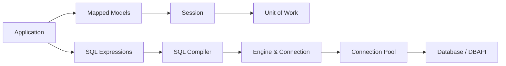

# sqlalchemy/sqlalchemy

> Boîte à outils SQL et ORM Python de référence, du SQL explicite aux objets mappés.

## Le problème
Écrire du SQL brut dispersé dans le code Python est fragile ; les ORM classiques cachent le SQL et produisent des requêtes opaques.

## Ce que ça fait vraiment
Core : langage d'expressions SQL, métadonnées de schéma, pool de connexions, types, réflexion et génération de schéma.
ORM séparé : identity map, unit of work, data mapper, chargement eager configurable, session transactionnelle.
Paramètres liés partout (pas d'injection SQL), dialectes PostgreSQL, MySQL, SQL Server, SQLite.
Support asynchrone (AsyncSession, AsyncEngine).

## Comment c'est branché

## Essayer
Aucune commande dans le README : l'installation est renvoyée à la documentation.

## Coût et pièges
Gratuit, MIT ; courbe d'apprentissage réelle sur sessions et stratégies de chargement.

## Ce que ce n'est pas
Pas un outil de migration : il faut un outil dédié pour versionner le schéma.
L'ORM n'est pas obligatoire : le README conseille le Core seul si le problème ne demande pas d'ORM.

## Alternatives
Aucune alternative nommée dans le README.

## Pour toi
À adopter : c'est la couche d'accès aux bases standard en Python, utile pour pipelines, feature stores maison et APIs de modèles.
