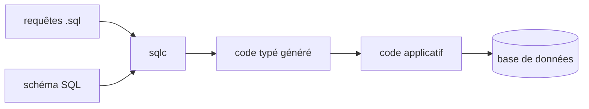

# sqlc-dev/sqlc

> Compilateur qui transforme des requêtes SQL écrites à la main en code typé.

## Le problème
Un ORM cache le SQL, et une requête écrite à la main perd tout contrôle de type à la compilation.
Les erreurs de colonne ou de type se découvrent alors à l'exécution.

## Ce que ça fait vraiment
Trois étapes annoncées : tu écris tes requêtes en SQL, tu lances sqlc, il génère des interfaces typées.
Ton code applicatif appelle ensuite le code généré plutôt que de construire des chaînes SQL.
Le README ne détaille ni les dialectes, ni les langages cibles, ni la configuration.
Il renvoie à un exemple interactif, un terrain de jeu, la documentation et la page de téléchargements.

## Comment c'est branché

## Essayer
Aucune commande documentée dans le README : il renvoie aux pages Installation et Downloads.

## Coût et pièges
Rien d'indiqué dans le README : ni prérequis, ni dépendance, ni coût.

## Ce que ce n'est pas
Pas un ORM : il ne masque pas le SQL, il en dérive des types.
Pas un client de base : il génère du code, l'exécution reste à ta charge.
Pas documenté ici : ce README fait moins de 800 caractères utiles, tout est ailleurs.

## Alternatives
Aucune nommée dans le README.

## Pour toi
Le principe est sain pour une API de données, mais juge sur pièces : rien n'est traçable depuis ce README.
