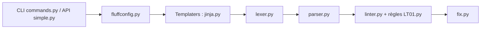

# sqlfluff/sqlfluff

> Linter SQL configurable, multi-dialectes, compatible Jinja et dbt, qui corrige automatiquement.

## Le problème
Le SQL des équipes data est écrit de façon inégale, et les revues de style monopolisent du temps.

## Ce que ça fait vraiment
Charge la configuration, rend les gabarits (Jinja, dbt), découpe et analyse le SQL avec la grammaire du dialecte choisi, applique des règles de lint et signale les violations. `sqlfluff fix` corrige la plupart d'entre elles. Un parseur optionnel en Rust s'installe via l'extra `rs`.

## Comment c'est branché


## Essayer
```bash
pip install sqlfluff
echo "  SELECT a  +  b FROM tbl;  " > test.sql
sqlfluff lint test.sql --dialect ansi
sqlfluff fix test.sql --dialect ansi
```

## Coût et pièges
Gratuit. L'extra `rs` peut demander une chaîne Rust si aucune roue n'existe pour ta plateforme. Il faut préciser le dialecte.

## Ce que ce n'est pas
Pas un formateur universel sans réglage : les règles se configurent. Il ne valide pas la logique d'une requête.

## Alternatives
- Aucune alternative nommée dans le README.

## Pour toi
À adopter : cadre ton SQL et tes modèles dbt en CI, s'installe par pip et s'intègre sans effort à un flux ELT.

