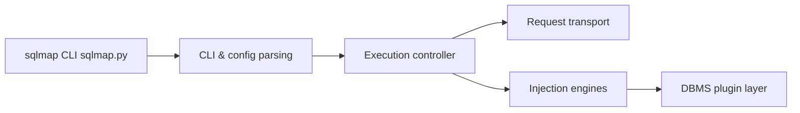

# sqlmapproject/sqlmap

> Outil de test d'intrusion qui détecte les failles d'injection SQL, pour auditeurs et équipes sécurité autorisés.

## Le problème
Vérifier à la main si une application web est vulnérable aux injections SQL est long et sujet à erreur.

## Ce que ça fait vraiment
Un programme Python en ligne de commande qui contrôle des cibles web, identifie le type de base de données et vérifie la présence de failles d'injection. Il s'appuie sur des moteurs de détection par technique et sur des greffons par système de base de données. Un service API (`sqlmapapi.py`) permet de le piloter à distance.

## Comment c'est branché


## Essayer
```bash
git clone --depth 1 https://github.com/sqlmapproject/sqlmap.git sqlmap-dev
python sqlmap.py -h
python sqlmap.py -hh
```

## Coût et pièges
Gratuit, Python 2.7 ou 3.x. Le vrai coût est juridique : l'usage sur un système sans autorisation écrite est illégal dans la plupart des pays.

## Ce que ce n'est pas
Ce n'est pas un scanner à lancer sur des cibles qui ne t'appartiennent pas. Le README ne détaille pas les cadres légaux ; la licence est présente mais non identifiée par GitHub.

## Alternatives
Le README ne nomme pas d'alternative.

## Pour toi
À surveiller : pertinent pour tester tes propres applications de données ou API, dans un périmètre autorisé ; vérifie le texte de la licence avant toute intégration.
