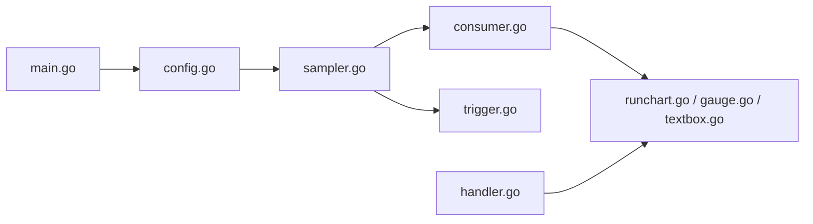

# sqshq/sampler

> Outil de terminal qui exécute des commandes shell à intervalle et les affiche en graphiques, via un fichier YAML.

## Le problème
Surveiller une métrique obtenue par une commande shell sans monter Prometheus et Grafana.

## Ce que ça fait vraiment
Lit un YAML, exécute les commandes (`sample`) au rythme voulu et affiche run charts, sparklines, barres, jauges, zones de texte, ASCII art. Des déclencheurs lancent alerte visuelle, son ou script. Un shell interactif (`init`) garde une session ouverte vers une base, SSH, JMX.

## Comment c'est branché


## Essayer
```bash
brew install sampler
sampler -c config.yml
docker build --tag sampler .
docker run --interactive --tty --volume $(pwd)/config.yml:/root/config.yml sampler --config /root/config.yml
```

## Coût et pièges
Gratuit. Sous Linux, `libasound2-dev` pour le son. Windows « expérimental ». Dernier push février 2024.

## Ce que ce n'est pas
Pas un système de monitoring complet (le README le dit) : ni stockage ni serveur. GPL-3.0.

## Alternatives
- Prometheus avec Grafana : cités par le README pour un suivi à grande échelle.

## Pour toi
À surveiller : pratique pour un tableau de bord jetable en terminal, mais sans commit depuis février 2024 ; pour de la production, préférer Prometheus et Grafana.

